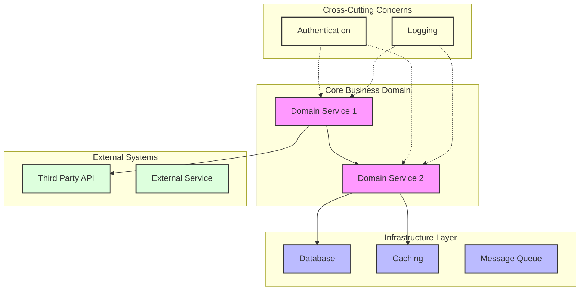

### High-Level Architecture Analysis Prompt ###

Based on the codebase analysis, create a Mermaid diagram that represents the system's high-level architecture. Focus on:

1. Core Business Domains
- Identify main business capabilities
- Group related functionality
- Highlight domain boundaries

2. Architectural Layers
- Frontend/UI components
- Business logic/Services
- Data access/Storage
- Infrastructure components

3. Key Integration Points
- External system dependencies
- APIs and interfaces
- Message queues/Event buses
- Third-party services

4. Cross-Cutting Concerns
- Authentication/Authorization
- Logging/Monitoring
- Configuration management
- Common utilities

### Diagram Requirements ###

Generate a Mermaid diagram using this structure:



### Analysis Instructions ###

1. Component Identification:
   - Extract key namespaces/packages
   - Identify primary services/modules
   - Map external dependencies
   - Note cross-cutting concerns

2. Relationship Analysis:
   - Map direct dependencies (solid lines)
   - Identify indirect dependencies (dashed lines)
   - Note data flow directions
   - Highlight critical paths

3. Grouping Guidelines:
   - Group by business capability
   - Separate infrastructure concerns
   - Isolate external integrations
   - Cluster related utilities

4. Style Conventions:
   - Core business logic: Pink fill
   - Infrastructure: Light blue fill
   - External systems: Light green fill
   - Utilities: Light yellow fill
   - Use double borders for critical components
   - Dashed lines for loose coupling
   - Solid lines for direct dependencies


Note: The above example structure should be automatically replaced with an actual diagram based on the codebase analysis below.

## The codebase:

<codebase>

<toc>
## Table of Contents

repo/Readme.md
repo/graphs
repo/miner-service/Dockerfile
repo/miner-service/.eslintrc
repo/miner-service/.dockerignore
repo/miner-service/Api.routing.ts
repo/miner-service/index.ts
repo/miner-service/.env.example
repo/miner-service/src/dynamo.ts
repo/miner-service/src/test/utils.spec.ts
repo/miner-service/src/graph/DexPairsRepositoryMemory.ts
repo/miner-service/src/graph/DexDataHandler.ts
repo/miner-service/src/graph/clients/matic_rc/resolvers.ts
repo/miner-service/src/graph/clients/matic_rc/tester.ts
repo/miner-service/src/graph/clients/matic_rc/.graphclientrc.yml
repo/miner-service/src/graph/clients/matic_rc/graphql/GetPoolsByIdsMatic.gql
repo/miner-service/src/graph/clients/matic_rc/graphql/GetPoolsMatic.gql
repo/miner-service/src/graph/clients/uniswap_rc/tester.ts
repo/miner-service/src/graph/clients/uniswap_rc/.graphclientrc.yml
repo/miner-service/src/graph/clients/uniswap_rc/graphql/GetPoolsUniswap.gql
repo/miner-service/src/graph/clients/uniswap_rc/graphql/GetPoolsUniswapLive.gql
repo/miner-service/src/graph/clients/eth_rc/resolvers.ts
repo/miner-service/src/graph/clients/eth_rc/tester.ts
repo/miner-service/src/graph/clients/eth_rc/.graphclientrc.yml
repo/miner-service/src/graph/clients/eth_rc/graphql/GetPoolsEth.gql
repo/miner-service/src/graph/clients/eth_rc/graphql/GetPoolsByIdsEth.gql
repo/miner-service/src/graph/clients/bsc_rc/resolvers.ts
repo/miner-service/src/graph/clients/bsc_rc/tester.ts
repo/miner-service/src/graph/clients/bsc_rc/.graphclientrc.yml
repo/miner-service/src/graph/clients/bsc_rc/graphql/GetPoolsBsc.gql
repo/miner-service/src/graph/clients/bsc_rc/graphql/GetPoolsByIdsBsc.gql
repo/miner-service/src/graph/clients/sushi_rc/tester.ts
repo/miner-service/src/graph/clients/sushi_rc/.graphclientrc.yml
repo/miner-service/src/graph/clients/sushi_rc/graphql/GetPoolsSushiLive.gql
repo/miner-service/src/graph/clients/sushi_rc/graphql/GetPoolsSushi.gql
repo/miner-service/src/graph/clients/pancake_rc/resolvers.ts
repo/miner-service/src/graph/clients/pancake_rc/tester.ts
repo/miner-service/src/graph/clients/pancake_rc/.graphclientrc.yml
repo/miner-service/src/graph/clients/pancake_rc/graphql/GetPoolsPancake.gql
repo/miner-service/src/graph/clients/pancake_rc/graphql/GetPoolsPancakeLive.gql
repo/miner-service/src/graph/inner/FilterBuilder.ts
repo/miner-service/src/graph/inner/Subscriber.ts
repo/miner-service/src/graph/api/ChainGraphClient.ts
repo/miner-service/src/graph/api/GraphApiResponse.ts
repo/miner-service/src/graph/jobs/LiveJob.ts
repo/miner-service/src/graph/jobs/PollingJob.ts
repo/miner-service/src/utils/utils.ts
repo/miner-service/src/utils/App.logger.ts
repo/miner-service/src/utils/fs.module.ts
repo/miner-service/src/utils/StartHelper.ts
repo/miner-service/src/models/GraphId.ts
repo/miner-service/src/models/ChainType.ts
repo/miner-service/src/models/domain.ts
repo/miner-service/src/models/GraphPool.ts
repo/miner-service/src/models/Token.ts
repo/miner-service/src/models/DexChainData.ts
repo/miner-service/src/scripts/graphcodegen.ts
repo/miner-service/src/scripts/deploy.ts
repo/k8s/front/front.yml
repo/k8s/front/service.yml
repo/k8s/base/token-cron-job.yml
repo/k8s/base/config.yml
repo/k8s/base/role-helper.yaml
repo/k8s/miner/miner-matic.yml
repo/.github/workflows/master.yaml
repo/ws-client/Dockerfile
repo/ws-client/next.config.js
repo/ws-client/README.md
repo/ws-client/.dockerignore
repo/ws-client/public/vercel.svg
repo/ws-client/public/next.svg
repo/ws-client/public/static/api-url
repo/ws-client/pages/_app.js
repo/ws-client/pages/WebSocketComponent.js
repo/ws-client/pages/index.js
repo/ws-client/pages/_document.js
repo/aws/env/test/main.tf
repo/aws/env/test/variables.tf
repo/aws/env/test/.terraform.lock.hcl
repo/aws/env/config/dev.conf
repo/aws/env/config/test.conf
repo/aws/env/config/dev.tfvars
repo/aws/env/config/test.tfvars
repo/aws/env/dev/outputs.tf
repo/aws/env/dev/main.tf
repo/aws/env/dev/variables.tf
repo/aws/modules/ws-api-vpc-module/variables.tf
repo/aws/modules/ws-api-vpc-module/network/output.tf
repo/aws/modules/ws-api-vpc-module/network/main.tf
repo/aws/modules/ws-api-vpc-module/network/groups.tf
repo/aws/modules/ws-api-vpc-module/network/53t.tf
repo/aws/modules/ws-api-vpc-module/network/variables.tf
repo/aws/modules/ws-api-vpc-module/network/iam.tf
repo/aws/modules/ws-api-vpc-module/network/alb.tf
repo/aws/modules/ws-api-vpc-module/network/vpc.tf
repo/aws/modules/eks/output.tf
repo/aws/modules/eks/main.tf
repo/aws/modules/eks/ecr.tf
repo/aws/modules/eks/variable.tf
repo/aws/modules/eks/eks.tf
repo/aws/modules/ws-api-module/output.tf
repo/aws/modules/ws-api-module/heartbeat_handler.tf
repo/aws/modules/ws-api-module/connection_table.tf
repo/aws/modules/ws-api-module/main.tf
repo/aws/modules/ws-api-module/variable.tf
repo/aws/modules/ws-api-module/api.tf
repo/aws/modules/ws-api-module/connection_handler.tf
repo/aws/modules/ws-api-module/files.tf
repo/aws/modules/ws-api-module/lambda/connection-handler/handler.py
repo/aws/modules/ws-api-module/lambda/heartbeat/handler.py
repo/aws/modules/create-user-module/outputs.tf
repo/aws/modules/create-user-module/main.tf
repo/aws/modules/create-user-module/variable.tf
repo/aws/modules/create-user-module/run.sh
repo/aws/modules/create-user-module/provider.tf
repo/aws/modules/create-user-module/.terraform.lock.hcl
repo/aws/modules/tf-state-module/main.tf
repo/aws/modules/tf-state-module/variables.tf
repo/aws/modules/compute-module/output.tf
repo/aws/modules/compute-module/main.tf
repo/aws/modules/compute-module/variable.tf
repo/aws/modules/compute-module/dynamo_stream_handler.tf
repo/aws/modules/compute-module/dynamodb.tf
repo/aws/modules/compute-module/files.tf
repo/aws/modules/compute-module/lambda/dynamo-stream-handler/handler.py

</toc>

<code>

## repo/Readme.md

```markdown
&lt;h1 align=&#34;center&#34;&gt;Real-Time DEX Data Aggregator Platform&lt;/h1&gt;


&lt;p align=&#34;center&#34;&gt;
  &lt;img src=&#34;https://raw.githubusercontent.com/devicons/devicon/master/icons/terraform/terraform-original.svg&#34; alt=&#34;terraform&#34; width=&#34;50&#34; height=&#34;50&#34;/&gt;
  &lt;img src=&#34;https://raw.githubusercontent.com/devicons/devicon/master/icons/amazonwebservices/amazonwebservices-original-wordmark.svg&#34; alt=&#34;aws&#34; width=&#34;50&#34; height=&#34;50&#34;/&gt;
  &lt;img src=&#34;https://raw.githubusercontent.com/devicons/devicon/master/icons/kubernetes/kubernetes-plain.svg&#34; alt=&#34;kubernetes&#34; width=&#34;50&#34; height=&#34;50&#34;/&gt;
  &lt;img src=&#34;https://raw.githubusercontent.com/devicons/devicon/master/icons/typescript/typescript-original.svg&#34; alt=&#34;typescript&#34; width=&#34;50&#34; height=&#34;50&#34;/&gt;
  &lt;img src=&#34;https://raw.githubusercontent.com/devicons/devicon/master/icons/react/react-original.svg&#34; alt=&#34;react&#34; width=&#34;50&#34; height=&#34;50&#34;/&gt;
  &lt;img src=&#34;https://avatars.githubusercontent.com/u/38020273?s=200&amp;v=4&#34; alt=&#34;graphprotocol&#34; width=&#34;50&#34; height=&#34;50&#34;/&gt;
&lt;/p&gt;

&lt;h2 align=&#34;center&#34;&gt;System Architecture (generated)&lt;/h2&gt;

&lt;p align=&#34;center&#34;&gt;
  &lt;img width=&#34;800&#34; alt=&#34;System Architecture Real-Time DEX&#34; src=&#34;https://github.com/user-attachments/assets/27947f74-2d94-46b1-bb1c-c49ea279de41&#34; /&gt;
&lt;/p&gt;

## 🏗 Architecture Overview

&lt;table&gt;
&lt;tr&gt;
&lt;td width=&#34;50%&#34;&gt;
&lt;h3&gt;Frontend Layer&lt;/h3&gt;

- Next.js client application deployed on EKS
- Real-time WebSocket integration
- Containerized deployment strategy
- Responsive data visualization components

&lt;h3&gt;API Layer&lt;/h3&gt;

- WebSocket API Gateway for real-time communication
- Connection handler Lambda
- Heartbeat handler Lambda
- Custom protocol for real-time updates
&lt;/td&gt;
&lt;td width=&#34;50%&#34;&gt;
&lt;h3&gt;Processing Layer&lt;/h3&gt;

- DynamoDB Stream handler for real-time updates
- DEX Miner Service for blockchain data collection
- Event-driven architecture
- Multi-chain support (ETH, BSC, Polygon)

&lt;h3&gt;Data Layer&lt;/h3&gt;

- DynamoDB tables for data storage
- WebSocket connections table
- Real-time data synchronization
- Optimized query patterns
&lt;/td&gt;
&lt;/tr&gt;
&lt;/table&gt;

## 🚀 Key Features

- **Real-Time Processing**: Built on AWS Lambda and DynamoDB Streams
- **Multi-Chain Support**: ETH, BSC, Polygon networks
- **Scalable Architecture**: EKS with auto-scaling capabilities
- **Infrastructure as Code**: Terraform modules for AWS resources
- **Secure Design**: Private VPC architecture with strict IAM policies

## 💻 Tech Stack

```mermaid
graph TD
    A[Frontend] --&gt; B[Infrastructure]
    A --&gt; C[Backend Services]
    B --&gt; D[AWS Services]
    C --&gt; D
    
    subgraph Frontend
        F1[Next.js]
        F2[React]
        F3[TypeScript]
    end
    
    subgraph &#34;Backend Services&#34;
        B1[WebSocket API]
        B2[Lambda Functions]
        B3[DynamoDB]
        B4[The Graph Protocol]
    end
    
    subgraph &#34;AWS Services&#34;
        A1[EKS]
        A2[ECR]
        A3[VPC]
        A4[API Gateway]
    end
```

## 📊 Project Structure

```plaintext
project/
├── aws/                    # Infrastructure as Code
│   ├── env/               # Environment-specific configurations
│   │   ├── dev/           # Development environment
│   │   └── prod/          # Production environment
│   └── modules/           # Reusable Terraform modules
├── k8s/                   # Kubernetes manifests
│   ├── base/              # Base configurations
│   ├── front/             # Frontend deployments
│   └── miner/             # Miner service deployments
├── miner-service/         # Blockchain data collector
└── ws-client/             # Next.js frontend application
```

## 🔧 Quick Start

&lt;details&gt;
&lt;summary&gt;Prerequisites&lt;/summary&gt;

- AWS CLI configured
- Terraform ≥ 1.0.0
- Node.js ≥ 16
- Docker
- kubectl
&lt;/details&gt;

&lt;details&gt;
&lt;summary&gt;Installation Steps&lt;/summary&gt;

1. Clone the repository
```bash
git clone https://github.com/yourusername/project-name.git
cd project-name
```

2. Deploy infrastructure
```bash
cd aws/env/dev
terraform init &amp;&amp; terraform apply
```

3. Deploy applications
```bash
kubectl apply -f k8s/base/
kubectl apply -f k8s/front/
kubectl apply -f k8s/miner/
```
&lt;/details&gt;

## 🤝 Connect with Me

&lt;p align=&#34;center&#34;&gt;
  &lt;a href=&#34;https://twitter.com/al0hatech&#34;&gt;
    &lt;img src=&#34;https://img.shields.io/twitter/follow/al0hatech?style=for-the-badge&amp;logo=twitter&amp;color=1DA1F2&#34; alt=&#34;Twitter&#34; /&gt;
  &lt;/a&gt;
  &lt;a href=&#34;https://www.linkedin.com/in/oleksii-bichuk-a2698613b/&#34;&gt;
    &lt;img src=&#34;https://img.shields.io/badge/LinkedIn-Connect-blue?style=for-the-badge&amp;logo=linkedin&#34; alt=&#34;LinkedIn&#34; /&gt;
  &lt;/a&gt;
&lt;/p&gt;

## 📝 License

This project is [MIT](LICENSE) licensed.

---
&lt;p align=&#34;center&#34;&gt;Made with ❤️ by Oleksii Bichuk&lt;/p&gt;

```


## repo/graphs

```unknown
https://api.thegraph.com/subgraphs/name/ianlapham/uniswap-v3-polygon
https://api.thegraph.com/subgraphs/name/ianlapham/uniswap-v3-bsc
https://api.thegraph.com/subgraphs/name/unchase/sushiswap-bsc   //sushi v2 bsc
https://api.thegraph.com/subgraphs/name/pancakeswap/exchange-v3-bsc  //pancake bsc
https://api.thegraph.com/subgraphs/name/pancakeswap/exchange-v3-eth  //pancale eth
https://api.thegraph.com/subgraphs/name/pancakeswap/masterchef-v3-bsc //pancake shef bsc
https://api.thegraph.com/subgraphs/name/pancakeswap/masterchef-v3-eth //pancake shef eth
https://thegraph.com/hosted-service/subgraph/pancakeswap/pairs // ????

```


## repo/miner-service/Dockerfile

```unknown
FROM node:16.15.0-alpine
ENV CHAINS=&#39;&#39;
ENV POLLING=false
ENV DEBUG=false
ENV DYNAMO_TABLE=&#39;&#39;
WORKDIR /src
COPY . .
RUN yarn install
RUN yarn build
RUN yarn codegen

COPY dist ./dist

# EXPOSE $PORT:$PORT
# EXPOSE 80 443
CMD [&#34;sh&#34;, &#34;-c&#34;, &#34;node dist/index.js ${CHAINS} ${DYNAMO_TABLE} ${POLLING} ${DEBUG}&#34; ]
```


## repo/miner-service/.eslintrc

```unknown
{
  &#34;root&#34;: true,
  &#34;parser&#34;: &#34;@typescript-eslint/parser&#34;,
  &#34;plugins&#34;: [&#34;@typescript-eslint&#34;, &#34;no-loops&#34;],
  &#34;extends&#34;: [
    &#34;eslint:recommended&#34;,
    &#34;plugin:security/recommended&#34;,
    &#34;plugin:@typescript-eslint/eslint-recommended&#34;,
    &#34;plugin:@typescript-eslint/recommended&#34;,
    &#34;plugin:prettier/recommended&#34;
  ],
  &#34;parserOptions&#34;: {
    &#34;ecmaVersion&#34;: 2018,
    &#34;project&#34;: &#34;tsconfig.json&#34;
  },
  &#34;rules&#34;: {
    &#34;@typescript-eslint/no-explicit-any&#34;: &#34;off&#34;,
    &#34;@typescript-eslint/explicit-module-boundary-types&#34;: 0,
    &#34;prettier/prettier&#34;: [
      &#34;error&#34;,
      {
        &#34;endOfLine&#34;: &#34;auto&#34;
      }
    ]
  }
}

```


## repo/miner-service/.dockerignore

```unknown
node_modules
dist
README.md
LICENSE
.env.*
```


## repo/miner-service/Api.routing.ts

```typescript
import { Router } from &#34;express&#34;;
import { container } from &#34;tsyringe&#34;;
import GraphController from &#34;./redundant/controllers/Graph.controller&#34;;
import AppRoute from &#34;./redundant/controllers/AppRoute&#34;;

export class AppRouting {
  constructor(private route: Router) {
    this.route = route;
    this.configure();
  }
  public configure() {
    const graphController = container.resolve(GraphController);
    this.addRoute(graphController);
  }

  private addRoute(appRoute: AppRoute) {
    this.route.use(appRoute.route, appRoute.router);
  }
}

```


## repo/miner-service/index.ts

```typescript
import &#34;reflect-metadata&#34;;
import { container } from &#34;tsyringe&#34;;
import { AppLogger } from &#34;./src/utils/App.logger&#34;;
import { getMemoryUsage } from &#34;./src/utils/utils&#34;;
import LiveJob from &#34;./src/graph/jobs/LiveJob&#34;;
import PollingJob from &#34;./src/graph/jobs/PollingJob&#34;;
import { parseArguments } from &#34;./src/utils/StartHelper&#34;;
import AWS from &#34;aws-sdk&#34;;

const envFile = process.env.CODEBUCKET_ENV
  ? `.env.${process.env.CODEBUCKET_ENV}`
  : &#34;.env.example&#34;;
require(&#34;dotenv&#34;).config({ path: envFile });

const MEMORY_LIMIT_TO_RESTART_SUBSCRIPTIONS_MB = 1800;
const DEFAULT_POLLING_INTERVAL_SECONDS = 15;

const liveJob = container.resolve(LiveJob);
const pollingJob = container.resolve(PollingJob);

(async () =&gt; {
  AWS.config.update({
    region: process.env.REGION,
    accessKeyId: process.env.AWS_ACCESS_KEY_ID,
    secretAccessKey: process.env.AWS_SECRET_ACCESS_KEY,
  });
  const { polling, debug, chains } = parseArguments();

  AppLogger.info(`polling:${polling}, debug:${debug},  chains:${chains}`);
  if (polling) {
    await pollingJob.StartPollingAsync(
      chains,
      DEFAULT_POLLING_INTERVAL_SECONDS
    );
  } else {
    await pollingJob.PreloadAll(chains);
  }

  if (debug) {
    setInterval(async () =&gt; {
      AppLogger.info(`Memory usage checker`);
      const { heapUsed } = getMemoryUsage();

      AppLogger.info(`Memory is okay Heap: ${heapUsed}MB`);
    }, 10000);
  }
})();

```


## repo/miner-service/.env.example

```unknown
AWS_ACCESS_KEY_ID=AKD
AWS_SECRET_ACCESS_KEY=ABC
REGION=us-east-1
DYNAMO_TABBLE=Table
```


## repo/miner-service/src/dynamo.ts

```typescript
import { GraphPoolData } from &#34;./models/GraphPool&#34;;
import { PromiseResult } from &#34;aws-sdk/lib/request&#34;;
import { AppLogger } from &#34;./utils/App.logger&#34;;
import AWS from &#34;aws-sdk&#34;;


export function createOrUpdate(poolData: GraphPoolData, dataId: string) {
  const t0 = poolData.token0;
  const t1 = poolData.token1;
  const item = {
    GraphId: { S: dataId },
    PairId: { S: poolData.pairId },
    dexPoolId: { S: poolData.dexPoolId ?? &#34;N/A&#34; },
    pair: { S: poolData.pair ?? &#34;N/A&#34; },
    token0Price: { S: poolData.token0Price },
    token1Price: { S: poolData.token1Price },
    token0: { S: `${t0.id}___${t0.symbol}___${t0.name}___${t0.decimals}` },
    token1: { S: `${t1.id}___${t1.symbol}___${t1.name}___${t1.decimals}` },
    volumeUSD: { S: poolData.totalVolumeUSD ?? &#34;0&#34; },
    
    
  };
  const dynamodb = new AWS.DynamoDB();
  const tableName = process.env.DYNAMO_TABLE;

  const putItemParams: AWS.DynamoDB.PutItemInput = {
    TableName: tableName,
    Item: item,
  };

  return awsCall(dynamodb.putItem(putItemParams).promise());
  
}

async function awsCall(
  func: Promise&lt;PromiseResult&lt;AWS.DynamoDB.PutItemOutput, AWS.AWSError&gt;&gt;
) {
  try {
    const result = await func;
    return result;
  } catch (e) {
    AppLogger.error(e.message);
  }
}

```


## repo/miner-service/src/test/utils.spec.ts

```typescript
import { assert } from &#34;chai&#34;;
import { distinct, getPairIds } from &#34;../utils/utils&#34;;
import { Fs } from &#34;../utils/fs.module&#34;;
import { join } from &#34;path&#34;;
import { GraphPoolData } from &#34;../models/GraphPool&#34;;

describe(&#34;test&#34;, async () =&gt; {
  const uni3 = await Fs.loadFileAsync&lt;GraphPoolData[]&gt;(
    join(__dirname, &#34;/data/uniswapv3mini.json&#34;)
  ); 
  const sushi2 = await Fs.loadFileAsync&lt;GraphPoolData[]&gt;(
    join(__dirname, &#34;/data/sushiv2mini.json&#34;)
  ); 

  it(&#34;distinct in many arrays should work correct&#34;, async () =&gt; {
    const ids3 = getPairIds(uni3);
    const ids2 = getPairIds(sushi2);

    const uniquePairs = distinct(ids2, ids3);

    assert(uni3.length === 4, &#34;uniswapv3mini.json file was changed&#34;);
    assert(sushi2.length === 6, &#34;sushiv2mini.json file was changed&#34;);
    assert(uniquePairs.length === 7, &#34;distinct works incorect&#34;);
  });
});


```


## repo/miner-service/src/graph/DexPairsRepositoryMemory.ts

```typescript
import { singleton } from &#34;tsyringe&#34;;
import { AppLogger } from &#34;../utils/App.logger&#34;;
import { graphToPairIdPools, distinct } from &#34;../utils/utils&#34;;
import { GraphId, PairId } from &#34;../models/GraphId&#34;;
import { GraphPoolData } from &#34;../models/GraphPool&#34;;
import { Chain } from &#34;../models/ChainType&#34;;

@singleton()
export class DexPairsRepositoryInMemory {
  private pairsToPools = new Map&lt;PairId, GraphPoolData[]&gt;();
  private chainPairs = new Map&lt;Chain, PairId[]&gt;();
  private chainPairPools = new Map&lt;Chain, [PairId, GraphPoolData[]][]&gt;();

  constructor() {
    AppLogger.info(&#34;DexPairsRepository ctor&#34;);
  }

  public getPairToPools(pairIds: PairId[]): Map&lt;string, GraphPoolData[]&gt; {
    const result = new Map&lt;string, GraphPoolData[]&gt;();

    for (const pairId of pairIds) {
      if (this.pairsToPools.has(pairId)) {
        const poolInfoArray = this.pairsToPools.get(pairId);
        result.set(pairId, poolInfoArray);
      }
    }

    return result;
  }

  public getStats() {
    const totalPairs = Array.from(this.chainPairs.values()).reduce(
      (x, c) =&gt; x + c.length,
      0
    );
    const chains = Array.from(this.chainPairs.keys());
    const chainPerPairs = chains.map((chain) =&gt; {
      const chainPairs = this.chainPairs.get(chain);
      return { pairsCount: chainPairs.length, chain: chain };
    });
    return { totalPairs, chainPerPairs };
  }

  public getPairs(chain: Chain): PairId[] {
    return this.chainPairs.get(chain);
  }

  public setChainPairs(chain: Chain, pairIds: PairId[]) {
    const chainPairs = this.chainPairs.get(chain);
    const newChainPairs = chainPairs ? distinct(chainPairs, pairIds) : pairIds;
    const newPairsHandled =
      !chainPairs || newChainPairs.length !== chainPairs.length;
    if (newPairsHandled) {
      this.chainPairs.set(chain, newChainPairs);
    }
  }

  public setChainPairPools(data: [GraphId, Map&lt;PairId, GraphPoolData[]&gt;][]) {
    const chainPairPools = graphToPairIdPools(data, this.chainPairs);
    this.chainPairPools = chainPairPools;
  }
}

```


## repo/miner-service/src/graph/DexDataHandler.ts

```typescript
import { singleton } from &#34;tsyringe&#34;;
import { AppLogger } from &#34;../utils/App.logger&#34;;
import { DexChainData } from &#34;../models/DexChainData&#34;;
import { createOrUpdate } from &#34;../dynamo&#34;;

@singleton()
export class DexDataHandler {
  constructor() {
    AppLogger.info(&#34;DexDataHandler ctor&#34;);
  }
  public async handle(graphData: DexChainData[]) {
    const dynamoTasks = graphData.map(async (data) =&gt; {
      const graphDataId = data.graphDataId.id();
      return data.data.map((item) =&gt; createOrUpdate(item, graphDataId));
    });
    await Promise.all(dynamoTasks.slice(0, 3));
  }
}

```


## repo/miner-service/src/graph/clients/matic_rc/resolvers.ts

```typescript
import { Resolvers, MeshContext } from &#34;./.graphclient&#34;;

export const resolvers: Resolvers = {
  Pool: {
    chainName: (root, args, context, info) =&gt;
      context.chainName || &#34;bentobox-avalanche&#34;,
  },
};

```


## repo/miner-service/src/graph/clients/matic_rc/tester.ts

```typescript
import {
  getBuiltGraphSDK,
  execute,
  GetPoolsByIdsMaticDocument,
} from &#34;./.graphclient&#34;;

(async () =&gt; {
  const where = {
    or: [
      {
        token0_in: [&#34;0xc2132d05d31c914a87c6611c10748aeb04b58e8f&#34;],
        totalValueLockedUSD_gt: 123332,
      },
      {
        token1_in: [&#34;0xc2132d05d31c914a87c6611c10748aeb04b58e8f&#34;],
        totalValueLockedUSD_gt: 123332,
      },
    ],
  };

  const w = await getBuiltGraphSDK()
    .GetPoolsByIdsMatic({
      first: 5000,
      skip: 0,
      where: where,
    })
    .catch((e) =&gt; console.log(e));

  debugger;
  
  
  
  
  

  const d = await execute(GetPoolsByIdsMaticDocument, {
    first: 9000,
    skip: 0,
    
  });

  const data = await getBuiltGraphSDK()
    .GetPoolsByIdsMatic({
      first: 5000,
      skip: 0,
      where: where,
      
      
      
      
      
    })
    .catch((e) =&gt; {});
  debugger;
})();

```


## repo/miner-service/src/graph/clients/matic_rc/.graphclientrc.yml

```yaml
sources:
  - name: uniswap_matic_3
    handler:
      graphql:
        endpoint: https://api.thegraph.com/subgraphs/name/ianlapham/uniswap-v3-polygon
        retry: 3
    transforms:
      - prefix:
          value: uniswap_matic_3_
          includeRootOperations: true
          includeTypes: false
      - autoPagination:
          validateSchema: true
          limitOfRecords: 1000
plugins:
  - pollingLive:
      defaultInterval: 1000
documents:
  - ./graphql/*.gql
serve:
  browser: false

```


## repo/miner-service/src/graph/clients/matic_rc/graphql/GetPoolsByIdsMatic.gql

```unknown
query GetPoolsByIdsMatic(
  $first: Int = 1000
  $skip: Int = 0
  $totalLocked: BigDecimal = 100
  $tokenIn: [String!]
  $tokenOut: [String!]
) {
  uniswap_matic_3_pools(
    first: $first
    skip: $skip
    orderBy: volumeUSD
    orderDirection: desc
    where: {
      and: [
        { or: [{ token0_in: $tokenOut }, { token0_in: $tokenIn }] }
        { or: [{ token1_in: $tokenOut }, { token1_in: $tokenIn }] }
        { totalValueLockedUSD_gt: $totalLocked }
        { token0Price_gt: 0 }
        { token1Price_gt: 0 }
      ]
    }
  ) {
    id
    token0 {
      id
      symbol
      decimals
    }
    token1 {
      id
      symbol
      decimals
    }
    poolDayData(first: 1, orderBy: date, orderDirection: desc) {
      id
      volumeUSD
      date
    }
    token1Price
    token0Price
    volumeUSD
    feeTier
  }
}

```


## repo/miner-service/src/graph/clients/matic_rc/graphql/GetPoolsMatic.gql

```unknown
query GetPoolsMatic(
  $first: Int = 1000
  $skip: Int = 0
  $totalLocked: BigDecimal = 100
  $where: Pool_filter
) {
  uniswap_matic_3_pools(
    first: $first
    skip: $skip
    orderBy: volumeUSD
    orderDirection: desc
    where: $where
  ) {
    id
    token0 {
      id
      symbol
      decimals
    }
    token1 {
      id
      symbol
      decimals
    }
    poolDayData(first: 1, orderBy: date, orderDirection: desc) {
      id
      volumeUSD
      date
    }
    token1Price
    token0Price
    volumeUSD
    feeTier
  }
}

```


## repo/miner-service/src/graph/clients/uniswap_rc/tester.ts

```typescript
import { getBuiltGraphSDK, execute } from &#34;./.graphclient&#34;;

(async () =&gt; {
  const w = await getBuiltGraphSDK().GetPoolsUniswap({ first: 20000, skip: 0 });
  debugger;
})();

```


## repo/miner-service/src/graph/clients/uniswap_rc/.graphclientrc.yml

```yaml
sources:
  - name: uniswap_eth_3
    handler:
      graphql:
        endpoint: https://api.thegraph.com/subgraphs/name/uniswap/uniswap-v3
        # strategy: race
        retry: 3
    transforms:
      - addSourceName: true
      - prefix:
          value: uniswap_eth_3_
          includeRootOperations: true
          includeTypes: false
      - autoPagination:
        validateSchema: true
        limitOfRecords: 1000
  - name: uniswap2_eth
    handler:
      graphql:
        endpoint: https://api.thegraph.com/subgraphs/name/uniswap/uniswap-v2
        retry: 3
    transforms:
      - addSourceName: true
      - prefix:
          value: uniswap_eth_2_
          includeRootOperations: true
          includeTypes: false
      - autoPagination:
        validateSchema: true
        limitOfRecords: 1000
  - name: uniswap_matic_3
    handler:
      graphql:
        endpoint: https://api.thegraph.com/subgraphs/name/ianlapham/uniswap-v3-polygon
        # strategy: race
        retry: 3
    transforms:
      - addSourceName: true
      - prefix:
          value: uniswap_matic_3_
          includeRootOperations: true
          includeTypes: false
      - autoPagination:
        validateSchema: true
        limitOfRecords: 1000
  - name: uniswap_bsc_3
    handler:
      graphql:
        endpoint: https://api.thegraph.com/subgraphs/name/ianlapham/uniswap-v3-bsc
        # strategy: race
        retry: 3
    transforms:
      - addSourceName: true
      - prefix:
          value: uniswap_bsc_3_
          includeRootOperations: true
          includeTypes: false
      - autoPagination:
        validateSchema: true
        limitOfRecords: 1000

plugins:
  - pollingLive:
      defaultInterval: 1000
documents:
  - ./graphql/GetPoolsUniswap.gql
  - ./graphql/GetPoolsUniswapLive.gql
serve:
  browser: false

```


## repo/miner-service/src/graph/clients/uniswap_rc/graphql/GetPoolsUniswap.gql

```unknown
query GetPoolsUniswap(
  $first: Int = 1000
  $skip: Int = 0
  $totalLocked: BigDecimal = 100
) {
  uniswap_eth_3_pools(
    first: $first
    skip: $skip
    orderBy: volumeUSD
    orderDirection: desc
    where: { totalValueLockedUSD_gt: $totalLocked }
  ) {
    id
    token0 {
      id
      symbol
      decimals
    }
    token1 {
      id
      symbol
      decimals
    }
    poolDayData(first: 1, orderBy: date, orderDirection: desc) {
      id
      volumeUSD
      date
    }
    token0Price
    token1Price
    volumeUSD
    feeTier
  }

  uniswap_eth_2_pairs(
    first: $first
    skip: $skip
    orderBy: volumeUSD
    orderDirection: desc
  ) {
    id
    token0 {
      id
      symbol
      decimals
    }
    token1 {
      id
      symbol
      decimals
    }

    token0Price
    token1Price
    volumeUSD
  }

  uniswap_matic_3_pools(
    first: $first
    skip: $skip
    orderBy: volumeUSD
    orderDirection: desc
    where: { totalValueLockedUSD_gt: $totalLocked }
  ) {
    id
    token0 {
      id
      symbol
      decimals
    }
    token1 {
      id
      symbol
      decimals
    }
    poolDayData(first: 1, orderBy: date, orderDirection: desc) {
      id
      volumeUSD
      date
    }
    token1Price
    token0Price
    volumeUSD
    feeTier
  }

  uniswap_bsc_3_pools(
    first: $first
    skip: $skip
    orderBy: volumeUSD
    orderDirection: desc
    where: { totalValueLockedUSD_gt: $totalLocked }
  ) {
    id
    token0 {
      id
      symbol
      decimals
    }
    token1 {
      id
      symbol
      decimals
    }
    poolDayData(first: 1, orderBy: date, orderDirection: desc) {
      id
      volumeUSD
      date
    }
    token1Price
    token0Price
    volumeUSD
    feeTier
  }
}

```


## repo/miner-service/src/graph/clients/uniswap_rc/graphql/GetPoolsUniswapLive.gql

```unknown
query GetPoolsUniswapLive(
  $first: Int = 100
  $skip: Int = 0
  $totalLocked: BigDecimal = 100
) @live {
  uniswap_eth_3_pools(
    first: $first
    skip: $skip
    orderBy: volumeUSD
    orderDirection: desc
    where: { totalValueLockedUSD_gt: $totalLocked }
  ) {
    id
    token0 {
      id
      symbol
      decimals
    }
    token1 {
      id
      symbol
      decimals
    }
    poolDayData(first: 1, orderBy: date, orderDirection: desc) {
      id
      volumeUSD
      date
    }
    token0Price
    token1Price
    volumeUSD
    feeTier
  }

  uniswap_eth_2_pairs(
    first: $first
    skip: $skip
    orderBy: volumeUSD
    orderDirection: desc
  ) {
    id
    token0 {
      id
      symbol
      decimals
    }
    token1 {
      id
      symbol
      decimals
    }

    token0Price
    token1Price
    volumeUSD
  }

  uniswap_matic_3_pools(
    first: $first
    skip: $skip
    orderBy: volumeUSD
    orderDirection: desc
    where: { totalValueLockedUSD_gt: $totalLocked }
  ) {
    id
    token0 {
      id
      symbol
      decimals
    }
    token1 {
      id
      symbol
      decimals
    }
    poolDayData(first: 1, orderBy: date, orderDirection: desc) {
      id
      volumeUSD
      date
    }
    token1Price
    token0Price
    volumeUSD
    feeTier
  }

  uniswap_bsc_3_pools(
    first: $first
    skip: $skip
    orderBy: volumeUSD
    orderDirection: desc
    where: { totalValueLockedUSD_gt: $totalLocked }
  ) {
    id
    token0 {
      id
      symbol
      decimals
    }
    token1 {
      id
      symbol
      decimals
    }
    poolDayData(first: 1, orderBy: date, orderDirection: desc) {
      id
      volumeUSD
      date
    }
    token1Price
    token0Price
    volumeUSD
    feeTier
  }
}

```


## repo/miner-service/src/graph/clients/eth_rc/resolvers.ts

```typescript
import { Resolvers, MeshContext } from &#34;./.graphclient&#34;;

export const resolvers: Resolvers = {
  Pool: {
    chainName: (root, args, context, info) =&gt;
      context.chainName || &#34;bentobox-avalanche&#34;,
  },
};

```


## repo/miner-service/src/graph/clients/eth_rc/tester.ts

```typescript
import { getBuiltGraphSDK, execute } from &#34;./.graphclient&#34;;

(async () =&gt; {
  
  
  
  
  
  
  
  const w = await getBuiltGraphSDK().GetPoolsEth({ first: 20000, skip: 0 });
  console.log(Object.keys(w).map((key) =&gt; w[key].length));
  debugger;
})();

```


## repo/miner-service/src/graph/clients/eth_rc/.graphclientrc.yml

```yaml
sources:
  - name: pancake_eth_3
    handler:
      graphql:
        endpoint: https://api.thegraph.com/subgraphs/name/pancakeswap/exchange-v3-eth
        retry: 3
    transforms:
      - prefix:
          value: pancake_eth_3_
          includeRootOperations: true
          includeTypes: false
      - autoPagination:
          validateSchema: true
          limitOfRecords: 1000
  - name: sushi3_eth
    handler:
      graphql:
        endpoint: https://api.thegraph.com/subgraphs/name/sushi-v3/v3-ethereum
        retry: 5
    transforms:
      - prefix:
          value: sushi_eth_3_
          includeRootOperations: true
          includeTypes: false
      - autoPagination:
          validateSchema: true
          limitOfRecords: 1000
  - name: sushi2_eth
    handler:
      graphql:
        endpoint: https://api.thegraph.com/subgraphs/name/sushiswap/exchange
        retry: 5
    transforms:
      - prefix:
          value: sushi_eth_2_
          includeRootOperations: true
          includeTypes: false
      - autoPagination:
          validateSchema: true
          limitOfRecords: 1000
  - name: uniswap_eth_3
    handler:
      graphql:
        endpoint: https://api.thegraph.com/subgraphs/name/uniswap/uniswap-v3
        # strategy: race
        retry: 3
    transforms:
      - addSourceName: true
      - prefix:
          value: uniswap_eth_3_
          includeRootOperations: true
          includeTypes: false
      - autoPagination:
          validateSchema: true
          limitOfRecords: 1000
  - name: uniswap2_eth
    handler:
      graphql:
        endpoint: https://api.thegraph.com/subgraphs/name/uniswap/uniswap-v2
        retry: 3
    transforms:
      - prefix:
          value: uniswap_eth_2_
          includeRootOperations: true
          includeTypes: false
      - autoPagination:
          validateSchema: true
          limitOfRecords: 1000
plugins:
  - pollingLive:
      defaultInterval: 1000
documents:
  - ./graphql/*.gql
serve:
  browser: false

```


## repo/miner-service/src/graph/clients/eth_rc/graphql/GetPoolsEth.gql

```unknown
query GetPoolsEth(
  $first: Int = 1000
  $skip: Int = 0
  $totalLocked: BigDecimal = 100
  $tokenIn: [String!]
  $tokenOut: [String!]
) {
  pancake_eth_3_pools(
    first: $first
    skip: $skip
    orderBy: volumeUSD
    orderDirection: desc

    where: {
      totalValueLockedUSD_gt: $totalLocked
      token0Price_gt: 0
      token1Price_gt: 0
    }
  ) {
    id
    token0 {
      id
      symbol
      name
    }
    token1 {
      id
      symbol
      name
    }
    poolDayData(first: 1, orderBy: date, orderDirection: desc) {
      id
      volumeUSD
      date
    }
    token0Price
    token1Price
    volumeUSD
    feeTier
  }

  sushi_eth_3_pools(
    first: $first
    skip: $skip
    orderBy: volumeUSD
    orderDirection: desc
    where: {
      totalValueLockedUSD_gt: $totalLocked
      token0Price_gt: 0
      token1Price_gt: 0
    }
  ) {
    id
    token0 {
      id
      symbol
      name
    }
    token1 {
      id
      symbol
      name
    }
    poolDayData(first: 1, orderBy: date, orderDirection: desc) {
      id
      volumeUSD
      date
    }
    token0Price
    token1Price
    volumeUSD
    feeTier
  }

  sushi_eth_2_pairs(
    first: $first
    skip: $skip
    orderBy: volumeUSD
    orderDirection: desc
    where: { token0Price_gt: 0, token1Price_gt: 0 }
  ) {
    id
    token0 {
      id
      symbol
      decimals
    }
    token1 {
      id
      symbol
      decimals
    }
    poolDayData: dayData(first: 1, orderBy: date, orderDirection: desc) {
      id
      volumeUSD
      date
    }
    token0Price
    token1Price
    volumeUSD
  }

  uniswap_eth_3_pools(
    first: $first
    skip: $skip
    orderBy: volumeUSD
    orderDirection: desc
    where: {
      totalValueLockedUSD_gt: $totalLocked
      token0Price_gt: 0
      token1Price_gt: 0
    }
  ) {
    id
    token0 {
      id
      symbol
      decimals
    }
    token1 {
      id
      symbol
      decimals
    }
    poolDayData(first: 1, orderBy: date, orderDirection: desc) {
      id
      volumeUSD
      date
    }
    token0Price
    token1Price
    volumeUSD
    feeTier
  }

  uniswap_eth_2_pairs(
    first: $first
    skip: $skip
    orderBy: volumeUSD
    orderDirection: desc
    where: { token0Price_gt: 0, token1Price_gt: 0 }
  ) {
    id
    token0 {
      id
      symbol
      decimals
    }
    token1 {
      id
      symbol
      decimals
    }

    token0Price
    token1Price
    volumeUSD
  }
}

```


## repo/miner-service/src/graph/clients/eth_rc/graphql/GetPoolsByIdsEth.gql

```unknown
query GetPoolsByIdsEth(
  $first: Int = 1000
  $skip: Int = 0
  $totalLocked: BigDecimal = 100
  $tokenIn: [String!]
  $tokenOut: [String!]
) {
  pancake_eth_3_pools(
    first: $first
    skip: $skip
    orderBy: volumeUSD
    orderDirection: desc

    where: {
      and: [
        { totalValueLockedUSD_gt: $totalLocked }
        { token0Price_gt: 0 }
        { token1Price_gt: 0 }
        { or: [{ token0_in: $tokenOut }, { token0_in: $tokenIn }] }
        { or: [{ token1_in: $tokenOut }, { token1_in: $tokenIn }] }
      ]
    }
  ) {
    id
    token0 {
      id
      symbol
      name
    }
    token1 {
      id
      symbol
      name
    }
    poolDayData(first: 1, orderBy: date, orderDirection: desc) {
      id
      volumeUSD
      date
    }
    token0Price
    token1Price
    volumeUSD
    feeTier
  }

  sushi_eth_3_pools(
    first: $first
    skip: $skip
    orderBy: volumeUSD
    orderDirection: desc
    where: {
      and: [
        { totalValueLockedUSD_gt: $totalLocked }
        { token0Price_gt: 0 }
        { token1Price_gt: 0 }
        { or: [{ token0_in: $tokenOut }, { token0_in: $tokenIn }] }
        { or: [{ token1_in: $tokenOut }, { token1_in: $tokenIn }] }
      ]
    }
  ) {
    id
    token0 {
      id
      symbol
      name
    }
    token1 {
      id
      symbol
      name
    }
    poolDayData(first: 1, orderBy: date, orderDirection: desc) {
      id
      volumeUSD
      date
    }
    token0Price
    token1Price
    volumeUSD
    feeTier
  }

  sushi_eth_2_pairs(
    first: $first
    skip: $skip
    orderBy: volumeUSD
    orderDirection: desc
    where: {
      and: [
        { token0Price_gt: 0 }
        { token1Price_gt: 0 }
        { or: [{ token0_in: $tokenOut }, { token0_in: $tokenIn }] }
        { or: [{ token1_in: $tokenOut }, { token1_in: $tokenIn }] }
      ]
    }
  ) {
    id
    token0 {
      id
      symbol
      decimals
    }
    token1 {
      id
      symbol
      decimals
    }
    poolDayData: dayData(first: 1, orderBy: date, orderDirection: desc) {
      id
      volumeUSD
      date
    }
    token0Price
    token1Price
    volumeUSD
  }

  uniswap_eth_3_pools(
    first: $first
    skip: $skip
    orderBy: volumeUSD
    orderDirection: desc
    where: {
      and: [
        { totalValueLockedUSD_gt: $totalLocked }
        { token0Price_gt: 0 }
        { token1Price_gt: 0 }
        { or: [{ token0_in: $tokenOut }, { token0_in: $tokenIn }] }
        { or: [{ token1_in: $tokenOut }, { token1_in: $tokenIn }] }
      ]
    }
  ) {
    id
    token0 {
      id
      symbol
      decimals
    }
    token1 {
      id
      symbol
      decimals
    }
    poolDayData(first: 1, orderBy: date, orderDirection: desc) {
      id
      volumeUSD
      date
    }
    token0Price
    token1Price
    volumeUSD
    feeTier
  }

  uniswap_eth_2_pairs(
    first: $first
    skip: $skip
    orderBy: volumeUSD
    orderDirection: desc
    where: {
      and: [
        { token0Price_gt: 0 }
        { token1Price_gt: 0 }
        { or: [{ token0_in: $tokenOut }, { token0_in: $tokenIn }] }
        { or: [{ token1_in: $tokenOut }, { token1_in: $tokenIn }] }
      ]
    }
  ) {
    id
    token0 {
      id
      symbol
      decimals
    }
    token1 {
      id
      symbol
      decimals
    }

    token0Price
    token1Price
    volumeUSD
  }
}

```


## repo/miner-service/src/graph/clients/bsc_rc/resolvers.ts

```typescript
import { Resolvers, MeshContext } from &#34;./.graphclient&#34;;

export const resolvers: Resolvers = {
  Pool: {
    chainName: (root, args, context, info) =&gt;
      context.chainName || &#34;bentobox-avalanche&#34;,
  },
};

```


## repo/miner-service/src/graph/clients/bsc_rc/tester.ts

```typescript
import { getBuiltGraphSDK, execute } from &#34;./.graphclient&#34;;

(async () =&gt; {
  const w = await getBuiltGraphSDK().GetPoolsBsc({ first: 20000, skip: 0 });
  debugger;
})();

```


## repo/miner-service/src/graph/clients/bsc_rc/.graphclientrc.yml

```yaml
sources:
  - name: uniswap_bsc_3
    handler:
      graphql:
        endpoint: https://api.thegraph.com/subgraphs/name/ianlapham/uniswap-v3-bsc
        # strategy: race
        retry: 3
    transforms:
      - addSourceName: true
      - prefix:
          value: uniswap_bsc_3_
          includeRootOperations: true
          includeTypes: false
      - autoPagination:
          validateSchema: true
          limitOfRecords: 1000
  - name: pancake_bsc_3
    handler:
      graphql:
        endpoint: https://api.thegraph.com/subgraphs/name/pancakeswap/exchange-v3-bsc
        retry: 3
    transforms:
      - prefix:
          value: pancake_bsc_3_
          includeRootOperations: true
          includeTypes: false
      - autoPagination:
          validateSchema: true
          limitOfRecords: 1000
  - name: sushi2_bsc
    handler:
      graphql:
        endpoint: https://api.thegraph.com/subgraphs/name/unchase/sushiswap-bsc
        retry: 5
    transforms:
      - addSourceName: true
      - prefix:
          value: sushi_bsc_2_
          includeRootOperations: true
          includeTypes: false
      - autoPagination:
          validateSchema: true
          limitOfRecords: 1000
plugins:
  - pollingLive:
      defaultInterval: 1000
documents:
  - ./graphql/*.gql
serve:
  browser: false

```


## repo/miner-service/src/graph/clients/bsc_rc/graphql/GetPoolsBsc.gql

```unknown
query GetPoolsBsc(
  $first: Int = 1000
  $skip: Int = 0
  $totalLocked: BigDecimal = 100
  $tokenIn: [String!]
  $tokenOut: [String!]
) {
  uniswap_bsc_3_pools(
    first: $first
    skip: $skip
    orderBy: volumeUSD
    orderDirection: desc
    where: {
      totalValueLockedUSD_gt: $totalLocked
      token0Price_gt: 0
      token1Price_gt: 0
    }
  ) {
    id
    token0 {
      id
      symbol
      decimals
    }
    token1 {
      id
      symbol
      decimals
    }
    poolDayData(first: 1, orderBy: date, orderDirection: desc) {
      id
      volumeUSD
      date
    }
    token1Price
    token0Price
    volumeUSD
    feeTier
  }

  pancake_bsc_3_pools(
    first: $first
    skip: $skip
    orderBy: volumeUSD
    orderDirection: desc
    where: {
      totalValueLockedUSD_gt: $totalLocked
      token0Price_gt: 0
      token1Price_gt: 0
    }
  ) {
    id
    token0 {
      id
      symbol
      name
    }
    token1 {
      id
      symbol
      name
    }
    poolDayData(first: 1, orderBy: date, orderDirection: desc) {
      id
      volumeUSD
      date
    }
    token0Price
    token1Price
    volumeUSD
    feeTier
  }

  sushi_bsc_2_pairs(
    first: $first
    skip: $skip
    orderBy: syncAtTimestamp
    orderDirection: desc
    where: { token0Price_gt: 0, token1Price_gt: 0 }
  ) {
    id
    token0 {
      id
      symbol
      decimals
    }
    token1 {
      id
      symbol
      decimals
    }

    token0Price
    token1Price
    reserve0
    reserve1
    syncAtTimestamp
  }
}

```


## repo/miner-service/src/graph/clients/bsc_rc/graphql/GetPoolsByIdsBsc.gql

```unknown
query GetPoolsByIdsBsc(
  $first: Int = 1000
  $skip: Int = 0
  $totalLocked: BigDecimal = 100
  $tokenIn: [String!]
  $tokenOut: [String!]
) {
  uniswap_bsc_3_pools(
    first: $first
    skip: $skip
    orderBy: volumeUSD
    orderDirection: desc
    where: {
      and: [
        { or: [{ token0_in: $tokenOut }, { token0_in: $tokenIn }] }
        { or: [{ token1_in: $tokenOut }, { token1_in: $tokenIn }] }
        { totalValueLockedUSD_gt: $totalLocked }
        { token0Price_gt: 0 }
        { token1Price_gt: 0 }
      ]
    }
  ) {
    id
    token0 {
      id
      symbol
      decimals
    }
    token1 {
      id
      symbol
      decimals
    }
    poolDayData(first: 1, orderBy: date, orderDirection: desc) {
      id
      volumeUSD
      date
    }
    token1Price
    token0Price
    volumeUSD
    feeTier
  }

  pancake_bsc_3_pools(
    first: $first
    skip: $skip
    orderBy: volumeUSD
    orderDirection: desc
    where: {
      and: [
        { or: [{ token0_in: $tokenOut }, { token0_in: $tokenIn }] }
        { or: [{ token1_in: $tokenOut }, { token1_in: $tokenIn }] }
        { totalValueLockedUSD_gt: $totalLocked }
        { token0Price_gt: 0 }
        { token1Price_gt: 0 }
      ]
    }
  ) {
    id
    token0 {
      id
      symbol
      name
    }
    token1 {
      id
      symbol
      name
    }
    poolDayData(first: 1, orderBy: date, orderDirection: desc) {
      id
      volumeUSD
      date
    }
    token0Price
    token1Price
    volumeUSD
    feeTier
  }

  sushi_bsc_2_pairs(
    first: $first
    skip: $skip
    orderBy: syncAtTimestamp
    orderDirection: desc
    where: {
      and: [
        { or: [{ token0_in: $tokenOut }, { token0_in: $tokenIn }] }
        { or: [{ token1_in: $tokenOut }, { token1_in: $tokenIn }] }
        { token0Price_gt: 0 }
        { token1Price_gt: 0 }
      ]
    }
  ) {
    id
    token0 {
      id
      symbol
      decimals
    }
    token1 {
      id
      symbol
      decimals
    }

    token0Price
    token1Price
    reserve0
    reserve1
    syncAtTimestamp
  }
}

```


## repo/miner-service/src/graph/clients/sushi_rc/tester.ts

```typescript
import { getBuiltGraphSDK, execute } from &#34;./.graphclient&#34;;

(async () =&gt; {
  const w = await getBuiltGraphSDK().GetPoolsSushi({ first: 20000, skip: 0 });
  debugger;
})();

```


## repo/miner-service/src/graph/clients/sushi_rc/.graphclientrc.yml

```yaml
sources:
  - name: sushi3_eth
    handler:
      graphql:
        endpoint: https://api.thegraph.com/subgraphs/name/sushi-v3/v3-ethereum
        retry: 5
    transforms:
      - addSourceName: true
      - prefix:
          value: sushi_eth_3_
          includeRootOperations: true
          includeTypes: false
      - autoPagination:
        validateSchema: true
        limitOfRecords: 1000
  - name: sushi2_eth
    handler:
      graphql:
        endpoint: https://api.thegraph.com/subgraphs/name/sushiswap/exchange
        retry: 5
    transforms:
      - addSourceName: true
      - prefix:
          value: sushi_eth_2_
          includeRootOperations: true
          includeTypes: false
      - autoPagination:
        validateSchema: true
        limitOfRecords: 1000
  - name: sushi2_bsc
    handler:
      graphql:
        endpoint: https://api.thegraph.com/subgraphs/name/unchase/sushiswap-bsc
        retry: 5
    transforms:
      - addSourceName: true
      - prefix:
          value: sushi_bsc_2_
          includeRootOperations: true
          includeTypes: false
      - autoPagination:
        validateSchema: true
        limitOfRecords: 1000

plugins:
  - pollingLive:
      defaultInterval: 1000
documents:
  - ./graphql/GetPoolsSushi.gql
  - ./graphql/GetPoolsSushiLive.gql
serve:
  browser: false

```


## repo/miner-service/src/graph/clients/sushi_rc/graphql/GetPoolsSushiLive.gql

```unknown
query GetPoolsSushiLive(
  $first: Int = 100
  $skip: Int = 0
  $totalLocked: BigDecimal = 100
) @live {
  sushi_eth_3_pools(
    first: $first
    skip: $skip
    orderBy: volumeUSD
    orderDirection: desc
    where: { totalValueLockedUSD_gt: $totalLocked }
  ) {
    id
    token0 {
      id
      symbol
      name
    }
    token1 {
      id
      symbol
      name
    }
    poolDayData(first: 1, orderBy: date, orderDirection: desc) {
      id
      volumeUSD
      date
    }
    token0Price
    token1Price
    volumeUSD
    feeTier
  }

  sushi_eth_2_pairs(
    first: $first
    skip: $skip
    orderBy: volumeUSD
    orderDirection: desc
  ) {
    id
    token0 {
      id
      symbol
      decimals
    }
    token1 {
      id
      symbol
      decimals
    }
    poolDayData: dayData(first: 1, orderBy: date, orderDirection: desc) {
      id
      volumeUSD
      date
    }
    token0Price
    token1Price
    volumeUSD
  }

  sushi_bsc_2_pairs(
    first: $first
    skip: $skip
    orderBy: syncAtTimestamp
    orderDirection: desc
  ) {
    id
    token0 {
      id
      symbol
      decimals
    }
    token1 {
      id
      symbol
      decimals
    }

    token0Price
    token1Price
    reserve0
    reserve1
    syncAtTimestamp
  }
}

```


## repo/miner-service/src/graph/clients/sushi_rc/graphql/GetPoolsSushi.gql

```unknown
query GetPoolsSushi(
  $first: Int = 100
  $skip: Int = 0
  $totalLocked: BigDecimal = 100
) {
  sushi_eth_3_pools(
    first: $first
    skip: $skip
    orderBy: volumeUSD
    orderDirection: desc
    where: { totalValueLockedUSD_gt: $totalLocked }
  ) {
    id
    token0 {
      id
      symbol
      name
    }
    token1 {
      id
      symbol
      name
    }
    poolDayData(first: 1, orderBy: date, orderDirection: desc) {
      id
      volumeUSD
      date
    }
    token0Price
    token1Price
    volumeUSD
    feeTier
  }

  sushi_eth_2_pairs(
    first: $first
    skip: $skip
    orderBy: volumeUSD
    orderDirection: desc
  ) {
    id
    token0 {
      id
      symbol
      decimals
    }
    token1 {
      id
      symbol
      decimals
    }
    poolDayData: dayData(first: 1, orderBy: date, orderDirection: desc) {
      id
      volumeUSD
      date
    }
    token0Price
    token1Price
    volumeUSD
  }

  sushi_bsc_2_pairs(
    first: $first
    skip: $skip
    orderBy: syncAtTimestamp
    orderDirection: desc
  ) {
    id
    token0 {
      id
      symbol
      decimals
    }
    token1 {
      id
      symbol
      decimals
    }

    token0Price
    token1Price
    reserve0
    reserve1
    syncAtTimestamp
  }
}

```


## repo/miner-service/src/graph/clients/pancake_rc/resolvers.ts

```typescript
import { Resolvers, MeshContext } from &#34;./.graphclient&#34;;

export const resolvers: Resolvers = {
  Pool: {
    chainName: (root, args, context, info) =&gt;
      context.chainName || &#34;bentobox-avalanche&#34;,
  },
};

```


## repo/miner-service/src/graph/clients/pancake_rc/tester.ts

```typescript
import { GetPoolsCakeDocument, execute } from &#34;./.graphclient&#34;;

(async () =&gt; {
  const data = await execute(GetPoolsCakeDocument, {});
})();

```


## repo/miner-service/src/graph/clients/pancake_rc/.graphclientrc.yml

```yaml
sources:
  - name: pancake_bsc_3
    handler:
      graphql:
        endpoint: https://api.thegraph.com/subgraphs/name/pancakeswap/exchange-v3-bsc
        retry: 3
    transforms:
      - prefix:
          value: pancake_bsc_3_
          includeRootOperations: true
          includeTypes: false
      - autoPagination:
        validateSchema: true
        limitOfRecords: 1000

  - name: pancake_eth_3
    handler:
      graphql:
        endpoint: https://api.thegraph.com/subgraphs/name/pancakeswap/exchange-v3-eth
        retry: 3
    transforms:
      - prefix:
          value: pancake_eth_3_
          includeRootOperations: true
          includeTypes: false
      - autoPagination:
        validateSchema: true
        limitOfRecords: 1000

plugins:
  - pollingLive:
      defaultInterval: 1000
documents:
  - ./graphql/*.gql
serve:
  browser: false

```


## repo/miner-service/src/graph/clients/pancake_rc/graphql/GetPoolsPancake.gql

```unknown
query GetPoolsPancake(
  $first: Int = 100
  $skip: Int = 0
  $totalLocked: BigDecimal = 100
) {
  pancake_bsc_3_pools(
    first: $first
    skip: $skip
    orderBy: volumeUSD
    orderDirection: desc
    where: { totalValueLockedUSD_gt: $totalLocked }
  ) {
    id
    token0 {
      id
      symbol
      name
    }
    token1 {
      id
      symbol
      name
    }
    poolDayData(first: 1, orderBy: date, orderDirection: desc) {
      id
      volumeUSD
      date
    }
    token0Price
    token1Price
    volumeUSD
    feeTier
  }

  pancake_eth_3_pools(
    first: $first
    skip: $skip
    orderBy: volumeUSD
    orderDirection: desc
    where: { totalValueLockedUSD_gt: $totalLocked }
  ) {
    id
    token0 {
      id
      symbol
      name
    }
    token1 {
      id
      symbol
      name
    }
    poolDayData(first: 1, orderBy: date, orderDirection: desc) {
      id
      volumeUSD
      date
    }
    token0Price
    token1Price
    volumeUSD
    feeTier
  }
}

```


## repo/miner-service/src/graph/clients/pancake_rc/graphql/GetPoolsPancakeLive.gql

```unknown
query GetPoolsPancakeLive(
  $first: Int = 100
  $skip: Int = 0
  $totalLocked: BigDecimal = 100
) @live {
  pancake_bsc_3_pools(
    first: $first
    skip: $skip
    orderBy: volumeUSD
    orderDirection: desc
    where: { totalValueLockedUSD_gt: $totalLocked }
  ) {
    id
    token0 {
      id
      symbol
      name
    }
    token1 {
      id
      symbol
      name
    }
    poolDayData(first: 1, orderBy: date, orderDirection: desc) {
      id
      volumeUSD
      date
    }
    token0Price
    token1Price
    volumeUSD
    feeTier
  }

  pancake_eth_3_pools(
    first: $first
    skip: $skip
    orderBy: volumeUSD
    orderDirection: desc
    where: { totalValueLockedUSD_gt: $totalLocked }
  ) {
    id
    token0 {
      id
      symbol
      name
    }
    token1 {
      id
      symbol
      name
    }
    poolDayData(first: 1, orderBy: date, orderDirection: desc) {
      id
      volumeUSD
      date
    }
    token0Price
    token1Price
    volumeUSD
    feeTier
  }
}

```


## repo/miner-service/src/graph/inner/FilterBuilder.ts

```typescript
import { Chain, PairId } from &#34;../../models/GraphId&#34;;


const ChainToWhere = {
  [Chain.matic]: {
    or: [
      {
        token0_in: [],
        totalValueLockedUSD_gt: 123332,
      },
      {
        token1_in: [],
        totalValueLockedUSD_gt: 123332,
      },
    ],
  },
};

const ChaintToFirstLimit = {
  [Chain.bsc]: 20000,
  [Chain.eth]: 20000,
  [Chain.matic]: 5000,
};

function createFilter(chain: Chain, pairIds: PairId[]) {
  const filter = ChaintToFirstLimit[chain];
  const o = ChainToWhere[chain];
}

```


## repo/miner-service/src/graph/inner/Subscriber.ts

```typescript
import { AppLogger } from &#34;../../utils/App.logger&#34;;
import { delay } from &#34;../../utils/utils&#34;;

export default class Subscriber {
  private _iterator: any;
  private _dexName: string;
  private stopIteration: boolean = false;
  private stopped: boolean = false;
  async Start(iterator: any, dexName: string, handler: any) {
    this._dexName = dexName;
    this._iterator = iterator;
    while (!this.stopIteration) {
      const { value, done } = await iterator.next();

      if (done) {
        break;
      }
      if (!value.data) {
        AppLogger.error(`${value.errors.map((e: any) =&gt; e.message)}`);
        continue;
      }

      handler(dexName, value.data);
    }
    this.stopped = true;
  }
  async Stop() {
    this._iterator.return?.();
    this.stopIteration = true;
    while (this.stopped !== true) {
      await delay(100);
    }
    AppLogger.info(`${this._dexName} iterator stopped`);
    return Promise.resolve(true);
  }
}

```


## repo/miner-service/src/graph/api/ChainGraphClient.ts

```typescript
import { getBuiltGraphSDK as ethSdk } from &#34;../clients/eth_rc/.graphclient&#34;;
import {
  GetPoolsByIdsBscQueryVariables,
  getBuiltGraphSDK as bscSdk,
} from &#34;../clients/bsc_rc/.graphclient&#34;;
import { getBuiltGraphSDK as maticSdk } from &#34;../clients/matic_rc/.graphclient&#34;;
import { Chain, ChainType } from &#34;../../models/ChainType&#34;;
import { AppLogger } from &#34;../../utils/App.logger&#34;;
import { GraphApiResponse } from &#34;./GraphApiResponse&#34;;
import { GraphPairId } from &#34;../../models/GraphId&#34;;

const ChaintToFirstLimit = {
  [Chain.bsc]: 20000,
  [Chain.eth]: 20000,
  [Chain.matic]: 5000,
};

export class ChainGraphClient {
  chainToApi = new Map&lt;Chain, any&gt;();

  constructor() {
    this.chainToApi.set(Chain.eth, {
      id: (filter) =&gt; ethSdk().GetPoolsByIdsEth(filter),
      all: (filter) =&gt; ethSdk().GetPoolsEth(filter),
    });

    this.chainToApi.set(Chain.bsc, {
      id: (filter) =&gt; bscSdk().GetPoolsByIdsBsc(filter),
      all: (filter) =&gt; bscSdk().GetPoolsBsc(filter),
    });

    this.chainToApi.set(Chain.matic, {
      id: (filter) =&gt; maticSdk().GetPoolsByIdsMatic(filter),
      all: (filter) =&gt; maticSdk().GetPoolsMatic(filter),
    });
  }

  public getChains(): Chain[] {
    return [Chain.bsc, Chain.eth, Chain.matic];
  }

  public getByIds(
    chain: Chain,
    pairIds: GraphPairId[],
    totalLocked: number = 1_000_000
  ): Promise&lt;GraphApiResponse&gt; {
    const api = this.chainToApi.get(chain);

    return this.apiCall(chain, () =&gt;
      api.id({
        skip: 0,
        totalLocked: totalLocked,
        tokenIn: pairIds.map((c) =&gt; c.left),
        tokenOut: pairIds.map((c) =&gt; c.right),
      })
    );
  }

  
  public getMaximumChainData(
    chain: Chain,
    totalLocked: number = 1_000_000
  ): Promise&lt;GraphApiResponse&gt; {
    const api = this.chainToApi.get(chain);
    const first = ChaintToFirstLimit[chain];
    return this.apiCall(chain, () =&gt;
      api.all({
        first: first,
        skip: 0,
        totalLocked: totalLocked,
      })
    );
  }

  public getAllChainsData(): Promise&lt;GraphApiResponse[]&gt; {
    const chains = Array.from(this.chainToApi.keys());
    const chainTasks = chains.map((chain) =&gt; {
      return this.getMaximumChainData(chain);
    });
    return Promise.all(chainTasks);
  }

  private async apiCall(
    chain: Chain,
    apiMethod: () =&gt; Promise&lt;any[]&gt;
  ): Promise&lt;GraphApiResponse&gt; {
    try {
      const response = await apiMethod();
      return {
        chain: chain,
        data: response || [],
        error: null,
      };
    } catch (error) {
      return {
        chain: chain,
        data: null,
        error: error.errors,
      };
    }
  }
}

```


## repo/miner-service/src/graph/api/GraphApiResponse.ts

```typescript
import { Chain } from &#34;../../models/ChainType&#34;;

export interface GraphApiResponse {
  chain: Chain;
  data: any[];
  error: any[];
}

```


## repo/miner-service/src/graph/jobs/LiveJob.ts

```typescript
import { autoInjectable, singleton } from &#34;tsyringe&#34;;

import { DexDataHandler } from &#34;../DexDataHandler&#34;;
import { AppLogger } from &#34;../../utils/App.logger&#34;;
import Subscriber from &#34;../inner/Subscriber&#34;;

@singleton()
@autoInjectable()
export default class LiveJob {
  handler: DexDataHandler;
  ready = false;
  _subscribers: Subscriber[] = [];
  constructor(handler_: DexDataHandler) {
    this.handler = handler_;
    AppLogger.info(`LiveJob ctor`);
  }

  async StartAsync() {
    
    
    
    
    
    
    
    
    
  }

  async RestartAsync() {
    await this.StopAsync();
    await this.StartAsync();
  }

  private async StopAsync() {
    await Promise.all(this._subscribers.map((c) =&gt; c.Stop));
    this._subscribers = [];
  }
}

```


## repo/miner-service/src/graph/jobs/PollingJob.ts

```typescript
import { autoInjectable, singleton } from &#34;tsyringe&#34;;
import { DexDataHandler } from &#34;../DexDataHandler&#34;;
import { AppLogger } from &#34;../../utils/App.logger&#34;;
import cron from &#34;node-cron&#34;;
import { DexChainData } from &#34;../../models/DexChainData&#34;;
import { ChainGraphClient } from &#34;../api/ChainGraphClient&#34;;
import { GraphApiResponse } from &#34;../api/GraphApiResponse&#34;;
import { createGraphData } from &#34;../../models/domain&#34;;
import { Chain } from &#34;../../models/ChainType&#34;;

@singleton()
@autoInjectable()
export default class PollingJob {
  handler: DexDataHandler;
  executor = new ChainGraphClient();
  jobs: cron.ScheduledTask[] = [];
  lock: Map&lt;string, boolean&gt; = new Map&lt;string, boolean&gt;();

  constructor(handler_: DexDataHandler) {
    this.handler = handler_;
    AppLogger.info(`PollingJob ctor`);
  }

  async StartPollingAsync(chains: Chain[], seconds: number) {
    chains.map(async (chain) =&gt; {
      const task = cron.schedule(`*/${seconds} * * * * *`, async () =&gt; {
        const data = await this.loadChain(chain);
        const parsedData: DexChainData[] = createGraphData(data.data);
        this.handler.handle(parsedData);
      });
      this.jobs.push(task);
    });
    this.jobs.forEach((task) =&gt; {
      task.start();
    });
  }

  async PreloadAll(chains: Chain[]): Promise&lt;GraphApiResponse[]&gt; {
    const all = await Promise.all(
      chains.map(async (chain) =&gt; {
        return this.loadChain(chain);
      })
    );

    return all;
  }

  private async loadChain(chain: Chain): Promise&lt;GraphApiResponse&gt; {
    if (this.lock.get(chain)) return;
    const start = Date.now();
    const data = await this.executor.getMaximumChainData(chain);
    const end = Date.now();

    AppLogger.info(`${chain} executed: ${end - start} ms`);
    this.lock.set(chain, false);
    if (data.error !== null) {
      AppLogger.error(data.error);
    }
    return data;
  }

  async StopAsync() {
    this.jobs.forEach((job) =&gt; {
      job.stop();
    });
    this.jobs = [];
  }
}

```


## repo/miner-service/src/utils/utils.ts

```typescript
import { Chain } from &#34;../models/ChainType&#34;;
import { GraphId, GraphPoolId, GraphPairId, PairId } from &#34;../models/GraphId&#34;;
import { GraphPoolData } from &#34;../models/GraphPool&#34;;

export function graphToPairIdPools(
  graphDexDatas: [GraphId, Map&lt;PairId, GraphPoolData[]&gt;][],
  uniquePairs: Map&lt;Chain, PairId[]&gt;
): Map&lt;Chain, [PairId, GraphPoolData[]][]&gt; {
  let chainTo = new Map&lt;Chain, [PairId, GraphPoolData[]][]&gt;();
  const chains = Array.from(uniquePairs.keys());

  const graphId =
    graphDexDatas[0].length &gt; 0
      ? GraphPoolId.Create(graphDexDatas[0][0])
      : null;

  if (!graphId) {
    return;
  }

  chains.forEach((chain) =&gt; {
    let pairToPools = new Map&lt;PairId, GraphPoolData[]&gt;();
    uniquePairs.get(chain).forEach((pairId: PairId) =&gt; {
      for (let j = 0; j &lt; graphDexDatas.length; j++) {
        const dexPools = graphDexDatas[j][1];

        if (dexPools.has(pairId)) {
          const pairData = dexPools.get(pairId);
          if (pairToPools.has(pairId)) {
            const poolData = pairToPools.get(pairId);
            pairToPools.set(pairId, distinct(poolData.concat(pairData)));
          } else {
            pairToPools.set(pairId, pairData);
          }
        }
      }
      const pairIdToPools = Array.from(pairToPools.entries());
      chainTo.set(chain, pairIdToPools);
    });
  });
  return chainTo;
}

export function toDictinary(
  pools: GraphPoolData[]
): Map&lt;PairId, GraphPoolData[]&gt; {
  const pairIdToPools = new Map&lt;PairId, GraphPoolData[]&gt;();

  pools.forEach((element) =&gt; {
    const graphPair = GraphPairId.From(element);
    const id = graphPair.id();
    pairIdToPools.has(id)
      ? pairIdToPools.get(id).push(element)
      : pairIdToPools.set(id, [element]);
  });
  return pairIdToPools;
}

const bytesToMb = (bytes) =&gt; Math.round((bytes / 1024 / 1024) * 100) / 100;
export function getMemoryUsage() {
  const used = process.memoryUsage();
  const row = {
    rss: bytesToMb(used.rss),
    heapTotal: bytesToMb(used.heapTotal),
    heapUsed: bytesToMb(used.heapUsed),
    external: bytesToMb(used.external),
    stack: bytesToMb(used.rss - used.heapTotal),
  };
  return row;
}

export function distinct(...arrays): any[] {
  const combinedArray = [].concat(...arrays);
  return [...new Set(combinedArray)];
}

export function distinctKey&lt;T&gt;(array: T[], key: keyof T): T[] {
  const map = new Map&lt;T[keyof T], T&gt;();
  for (const item of array) {
    map.set(item[key], item);
  }
  return Array.from(map.values());
}

export function toPairId(element: any): PairId {
  return `${element.token0.id}_${element.token1.id}`;
}

export function getPairIds(pools: GraphPoolData[]): PairId[] {
  return pools.map((p) =&gt; p.pairId);
}

export function delay(ms: number): Promise&lt;void&gt; {
  return new Promise((resolve) =&gt; setTimeout(resolve, ms));
}

```


## repo/miner-service/src/utils/App.logger.ts

```typescript
import { Logger, format, createLogger, transports, log } from &#34;winston&#34;;
import { Fs } from &#34;./fs.module&#34;;

export class AppLogger {
  static customDateFormat = format.printf(({ timestamp, level, message }) =&gt; {
    const formattedTimestamp = timestamp;
    return `[${formattedTimestamp}] ${level.toUpperCase()}: ${message}`;
  });

  private static logger = createLogger({
    level: &#34;info&#34;,
    format: format.combine(
      format.timestamp(), 
      AppLogger.customDateFormat 
    ),
    transports: [
      new transports.Console(),
      new transports.File({ filename: &#34;combined.log&#34; }),
    ],
  });

  public static file() {
    
    
    
    
  }
  public static info(data) {
    this.logger.log(&#34;info&#34;, this.GetValue(data));
  }
  public static debug(data) {
    this.logger.log(&#34;debug&#34;, this.GetValue(data));
  }

  public static error(data) {
    this.logger.log(&#34;error&#34;, this.GetValue(data));
  }

  private static GetValue(value: any) {
    return typeof value === &#34;string&#34; ? ` ${value}` : `${JSON.stringify(value)}`;
  }
}

```


## repo/miner-service/src/utils/fs.module.ts

```typescript
var fs = require(&#34;fs&#34;);

export namespace Fs {
  export function isFileExistsAsync(path: string) {
    return new Promise(function (resolve, reject) {
      fs.exists(path, function (exists) {
        resolve(exists);
      });
    });
  }
  export function loadFileAsync&lt;T&gt;(path: string): Promise&lt;T&gt; {
    return new Promise((res, rej) =&gt; {
      fs.readFile(path, &#34;utf-8&#34;, function (err, data) {
        if (err) {
          rej(err);
        }
        const items = JSON.parse(data) as T;
        res(items);
      });
    });
  }
  export function writeAsync(path: string, data: any): Promise&lt;boolean&gt; {
    return new Promise((res, rej) =&gt; {
      fs.writeFile(path, JSON.stringify(data), (err) =&gt; {
        if (err) rej(err);
      });
      res(true);
    });
  }

  export function updateAsync(
    path: string,
    publicKey: string,
    data: any
  ): Promise&lt;boolean&gt; {
    return new Promise((resolve, reject) =&gt; {
      fs.readFile(path, &#34;utf8&#34;, (readErr, fileData) =&gt; {
        if (readErr) {
          resolve(false);
        } else {
          try {
            const parsedData = JSON.parse(fileData);
            const updatedData = parsedData.map((item) =&gt; {
              if (item.publicKey === publicKey) {
                return { ...item, ...data };
              }
              return item;
            });

            fs.writeFile(path, JSON.stringify(updatedData), (writeErr) =&gt; {
              if (writeErr) {
                resolve(false);
              } else {
                resolve(true);
              }
            });
          } catch (e) {
            resolve(false);
          }
        }
      });
    });
  }
}

```


## repo/miner-service/src/utils/StartHelper.ts

```typescript
import { Chain } from &#34;../models/ChainType&#34;;

export function parseArguments(): IStartConfig {
  const defaultPollingMode = true;
  const defaultDebugMode = false;

  const port = parseInt(process.env.PORT, 10) || 3000;
  const chainsArg = process.argv[2];
  const dynamoTable = process.argv[3];
  const pollingArg = process.argv[4];
  const debugArg = process.argv[5];

  if (!chainsArg) {
    throw new Error(&#34;Chains argument is missing.&#34;);
  }

  const chains = chainsArg.split(&#34;,&#34;).map((c) =&gt; Chain[c.trim()]);

  if (!pollingArg) {
    console.warn(&#34;Polling argument is missing. Defaulting to true.&#34;);
  }

  const polling = pollingArg ? parseBool(pollingArg) : defaultPollingMode;

  if (!debugArg) {
    console.warn(&#34;Debug argument is missing. Defaulting to false.&#34;);
  }

  const debug = debugArg ? parseBool(debugArg) : defaultDebugMode;

  return { chains, dynamoTable, polling, debug, port };
}

function parseBool(str: string): boolean {
  const normalizedStr = str.toLowerCase();
  return normalizedStr === &#34;true&#34;;
}

interface IStartConfig {
  chains: Chain[];
  dynamoTable: string;
  port: number;
  debug: boolean;
  polling: boolean;
}

```


## repo/miner-service/src/models/GraphId.ts

```typescript
import { Chain } from &#34;./ChainType&#34;;
import { GraphPoolData } from &#34;./GraphPool&#34;;

export interface GraphDataId {
  dexName: string;
  chain: Chain;
  version: string; 
  id(): GraphId;
}
export type GraphId = string; 
export type PairId = string; 

export class GraphPairId {
  left: string;
  right: string;

  constructor(left: string, right: string) {
    this.left = left;
    this.right = right;
  }

  public id = () =&gt; `${this.left}_${this.right}`;

  public static From(pool: GraphPoolData): GraphPairId {
    const regex = /^[\d]+_[\d]+$/;
    const valid = &#34;token0&#34; in pool &amp;&amp; &#34;token1&#34; in pool;
    if (!valid) throw new Error(&#34;Invalid PairId&#34;);
    const pairId = new GraphPairId(pool.token0.id, pool.token1.id);
    return pairId;
  }
}
export class GraphPoolId implements GraphDataId {
  dexName: string;
  version: string;
  chain: Chain;
  constructor(dexName_: string, chain_: Chain | string, version_: string) {
    this.dexName = dexName_;
    this.chain = typeof chain_ === &#34;string&#34; ? Chain[chain_] : chain_;
    this.version = version_;
  }

  public id(): GraphId {
    return `${this.dexName}_${this.chain}_${this.version}`;
  }

  static Create(key: string) {
    const fields = key.split(&#34;_&#34;);
    const dexName = fields[0];

    const chain = fields[1];
    const version = fields[2];
    return new GraphPoolId(dexName, chain, version);
  }
}

```


## repo/miner-service/src/models/ChainType.ts

```typescript
export type ChainType = Chain | string;
export enum Chain {
  bsc = &#34;bsc&#34;,
  eth = &#34;eth&#34;,
  matic = &#34;matic&#34;,
}

```


## repo/miner-service/src/models/domain.ts

```typescript
import { DexChainData } from &#34;./DexChainData&#34;;
import { toPairId } from &#34;../utils/utils&#34;;
import { GraphDataId, GraphPoolId } from &#34;./GraphId&#34;;
import { GraphPoolData } from &#34;./GraphPool&#34;;

export function createGraphData(result: any): DexChainData[] {
  return Object.keys(result).map((key) =&gt; {
    const id: GraphDataId = GraphPoolId.Create(key);
    const data: any[] = result[key];

    const now = Date.now();
    data.map((d) =&gt; {
      d.id = id;
      d.pairId = toPairId(d);
      d.fee = d.feeTier ? parseFloat(d.feeTier) / 10000 : 0;
      d.pair = `${d.token0.symbol}/${d.token1.symbol}`;
      d.timestamp = d.syncAtTimestamp || now;
      delete d.feeTier;
    });
    return { graphDataId: id, data };
  });
}

```


## repo/miner-service/src/models/GraphPool.ts

```typescript
import { GraphPoolId, PairId } from &#34;./GraphId&#34;;
import { IToken } from &#34;./Token&#34;;


export type GraphPoolType = GraphPoolData;

export interface GraphPoolData {
  id: GraphPoolId; 
  dexPoolId: string; 
  pairId: PairId; 
  pair: string;

  token0: IToken;
  token1: IToken;

  fee: number;

  token0Price: string;
  token1Price: string;
  poolDayData: [];
  totalVolumeUSD: string;

  reserve0: string;
  reserve1: string;
  syncDate: string;
}

export interface GraphPoolApi {
  poolId: string;
  token0Price: string;
  token1Price: string;
  pair: string;
  fee: number;
  dexName: string;
  totalVolumeUSD: string;
  poolDayData: any[];
  reserve0: string;
  reserve1: string;
  syncDate: string;
}

```


## repo/miner-service/src/models/Token.ts

```typescript
export interface IToken {
  id: string;
  symbol: string;
  name: string;
  decimals: string;
  getId(): string;
}

export class Token implements IToken {
  id: string;
  symbol: string;
  name: string;
  decimals: string;
  public getId = () =&gt;
    `${this.id}_${this.symbol}_${this.name}_${this.decimals}`;
}

```


## repo/miner-service/src/models/DexChainData.ts

```typescript
import { GraphDataId } from &#34;./GraphId&#34;;
import { GraphPoolData } from &#34;./GraphPool&#34;;

export interface DexChainData {
  graphDataId: GraphDataId;
  data: GraphPoolData[];
}

```


## repo/miner-service/src/scripts/graphcodegen.ts

```typescript
const fs = require(&#34;fs&#34;);
const { exec } = require(&#34;child_process&#34;);

const parentFolder = &#34;./src/graph/clients&#34;; 

fs.readdir(parentFolder, (err, files) =&gt; {
  if (err) {
    console.error(&#34;Error reading directory:&#34;, err);
    return;
  }

  const clientFolders = files.filter(
    (file) =&gt;
      fs.statSync(`${parentFolder}/${file}`).isDirectory() &amp;&amp;
      file.endsWith(&#34;_rc&#34;)
  );

  clientFolders.forEach((folder) =&gt; {
    const folderPath = `${parentFolder}/${folder}`;
    exec(
      &#34;yarn install &amp;&amp; npm run codegen&#34;,
      { cwd: folderPath },
      (error, stdout, stderr) =&gt; {
        if (error) {
          console.error(
            `Error running &#39;npm run codegen&#39; in ${folderPath}:`,
            error
          );
        } else {
          console.log(
            `&#39;npm run codegen&#39; executed successfully in ${folderPath}`
          );
        }
        console.log(stdout);
        console.error(stderr);
      }
    );
  });
});

```


## repo/miner-service/src/scripts/deploy.ts

```typescript
import * as fs from &#34;fs-extra&#34;;
const fss = require(&#34;fs&#34;);
const sourceDir = &#34;./src/graph/clients&#34;;
const targetDir = &#34;dist/src/graph/clients&#34;;

fss.readdir(sourceDir, (err, files) =&gt; {
  if (err) {
    console.error(&#34;Error reading directory:&#34;, err);
    return;
  }
  for (const folder of files) {
    const sourcePath = `${sourceDir}/${folder}`;
    const targetPath = `${targetDir}/${folder}`;

    fs.copySync(sourcePath, targetPath);
    fs.removeSync(targetPath + &#34;/node_modules&#34;);
    console.log(folder, &#34;copied&#34;);
  }
  console.log(&#34;Copy completed.&#34;);
});

```


## repo/k8s/front/front.yml

```yaml
apiVersion: apps/v1
kind: Deployment
metadata:
  name: front
  namespace: front
spec:
  replicas: 1
  selector:
    matchLabels:
      app: front
  template:
    metadata:
      labels:
        app: front
    spec:
      containers:
        - name: front
          # image: ${AWS_ACCOUNT}.dkr.ecr.${AWS_REGION}.amazonaws.com/test/client-service:latest
          image: 559073480624.dkr.ecr.eu-west-1.amazonaws.com/front:latest
          imagePullPolicy: Always
          ports:
            - containerPort: 3000
              name: front-port
          # env:
          #   - name: AWS_ACCOUNT
          #     valueFrom:
          #       secretKeyRef:
          #         name: aws-secret
          #         key: AWS_ACCOUNT
          envFrom:
            - configMapRef:
                name: front-config
            - secretRef:
                name: aws-secret
      imagePullSecrets:
        - name: aws-secret

```


## repo/k8s/front/service.yml

```yaml
apiVersion: v1
kind: Service
metadata:
  name: simple-web-service
  namespace: front
spec:
  selector:
    app: front
  ports:
    - protocol: TCP
      port: 8080
      targetPort: front-port
  type: LoadBalancer

```


## repo/k8s/base/token-cron-job.yml

```yaml
apiVersion: batch/v1
kind: CronJob
metadata:
  name: job-ecr-refresh-token
  namespace: front
spec:
  schedule: &#34;0 */10 * * *&#34;
  successfulJobsHistoryLimit: 3
  suspend: false
  jobTemplate:
    spec:
      template:
        spec:
          # serviceAccountName: sa-default
          containers:
            - name: job-ecr-refresh-token
              image: odaniait/aws-kubectl:latest
              imagePullPolicy: IfNotPresent
              envFrom:
                - secretRef:
                    name: aws-secret
                - configMapRef:
                    name: front-config
                    # key: AWS_REGION
              command:
                - /bin/sh
                - -c
                - |-
                  echo &#34;ECR TOKEN REFRESHING &#34;
                  ECR_TOKEN=`aws ecr get-login-password --region ${AWS_REGION}`
                  NAMESPACE_NAME=front
                  kubectl delete secret --ignore-not-found $DOCKER_SECRET_NAME -n $NAMESPACE_NAME
                  kubectl create secret docker-registry $DOCKER_SECRET_NAME \
                  --docker-server=https://${AWS_ACCOUNT}.dkr.ecr.${AWS_REGION}.amazonaws.com \
                  --docker-username=AWS \
                  --docker-password=&#34;${ECR_TOKEN}&#34; \
                  --namespace=$NAMESPACE_NAME
                  echo &#34;ECR TOKEN REFRESHED at $(date)&#34;
          restartPolicy: Never

```


## repo/k8s/base/config.yml

```yaml
apiVersion: v1
kind: ConfigMap
metadata:
  name: front-config
  namespace: front
data:
  AWS_REGION: &#34;eu-west-1&#34;
  DOCKER_SECRET_NAME: aws-secret

```


## repo/k8s/base/role-helper.yaml

```yaml
apiVersion: v1
kind: ServiceAccount
metadata:
  name: sa-default
  namespace: front
---
apiVersion: rbac.authorization.k8s.io/v1
kind: Role
metadata:
  name: role-full-access-to-secrets
  namespace: front
rules:
  - apiGroups: [&#34;&#34;]
    resources: [&#34;secrets&#34;]
    resourceNames: [&#34;aws-secret&#34;]
    verbs: [&#34;delete&#34;]
  - apiGroups: [&#34;&#34;]
    resources: [&#34;secrets&#34;]
    verbs: [&#34;create&#34;]
---
kind: RoleBinding
apiVersion: rbac.authorization.k8s.io/v1
metadata:
  name: default-role-binding
  namespace: front
subjects:
  - kind: ServiceAccount
    name: sa-default
    namespace: front
    apiGroup: &#34;&#34;
roleRef:
  kind: Role
  name: role-full-access-to-secrets
  apiGroup: &#34;&#34;

```


## repo/k8s/miner/miner-matic.yml

```yaml
apiVersion: apps/v1
kind: Deployment
metadata:
  name: miner
spec:
  replicas: 2
  selector:
    matchLabels:
      app: miner
  template:
    metadata:
      labels:
        app: miner
    spec:
      containers:
        - name: miner
          image: 559073480624.dkr.ecr.eu-west-1.amazonaws.com/miner:latest
          ports:
            - containerPort: 3000
          envFrom:
            - configMapRef:
                name: config-map

```


## repo/.github/workflows/master.yaml

```yaml
name: CICD

on:
  pull_request:
    branches: [master]
  push:
    branches: [master]
  workflow_dispatch:
    inputs:
      # Working directory input from user.
      resource:
        type: choice
        description: Choose the resource
        options:
          - name_of_dir1
          - name_of_dir2
      # Terraform action you want to perform
      action:
        description: &#34;Terraform Action to Perform&#34;
        type: choice
        options:
          - Terraform_apply
          - Terraform_destroy
env:
  REGION: eu-west-1
  ENVIRONMENT: dev
  DEV_CLUSTER_KUBECONF: ${{ secrets.KUBE_CONFIG_DATA_DEV }}
jobs:
  # paths-filter:
  #   runs-on: ubuntu-latest
  #   outputs:
  #     output1: ${{ steps.filter.outputs.aws }}
  #     output2: ${{ steps.filter.outputs.miner }}
  #     output3: ${{ steps.filter.outputs.client }}
  #   steps:
  #     - uses: actions/checkout@v2
  #     - uses: dorny/paths-filter@v2
  #       id: filter
  #       with:
  #         filters: |
  #           aws:
  #             - &#39;./aws/env/dev&#39;
  #           miner:
  #             - &#39;./miner-service/**&#39;
  #           client:
  #             - &#39;./ws-client/**&#39;
  configure:
    runs-on: ubuntu-latest
    steps:
      - name: Set up Node.js
        uses: actions/setup-node@v2
        with:
          node-version: 18
      - name: Configure AWS CLI
        uses: aws-actions/configure-aws-credentials@v4
        with:
          aws-access-key-id: ${{ secrets.AWS_ACCESS_KEY }}
          aws-secret-access-key: ${{ secrets.AWS_SECRET_KEY }}
          aws-region: ${{env.REGION}}

  terraform:
    runs-on: ubuntu-latest
    needs: configure
    # if: needs.paths-filter.outputs.output1 == &#39;true&#39;
    env:
      AWS_ACCESS_KEY_ID: ${{ secrets.AWS_ACCESS_KEY }}
      AWS_SECRET_ACCESS_KEY: ${{ secrets.AWS_SECRET_KEY }}
    steps:
      - uses: actions/checkout@v2
      - uses: hashicorp/setup-terraform@v2
      - name: AWS infrastructure
        run: |
          echo HELLO, MY FOLDER $(pwd), ls $(ls)
          cd ./aws/env/${{env.ENVIRONMENT}}
          terraform init -backend-config=../config/${{env.ENVIRONMENT}}.conf -force-copy 
          terraform plan -out plan -var-file=../config/${{env.ENVIRONMENT}}.tfvars -var &#34;region=$REGION&#34; -var &#34;azs=[\&#34;$REGIONa\&#34;,\&#34;$REGIONb\&#34;]&#34; -var &#34;aws_access_key=${{ secrets.AWS_ACCESS_KEY }}&#34; -var &#34;aws_secret_key=${{ secrets.AWS_SECRET_KEY }}&#34;
          terraform apply -auto-approve plan
          terraform output -json &gt; terraform_output.json
          ws_url=$(jq -r .ws_url.value terraform_output.json)
          cluster_name=$(jq -r .eks_cluster_name.value terraform_output.json)
          ecr_miner_url=$(jq -r .ecr_miner_url.value terraform_output.json)
          ecr_front_url=$(jq -r .ecr_front_url.value terraform_output.json)
          data_dynamodb_table=$(jq -r .data_dynamodb_table.value terraform_output.json)
          echo table:$data_dynamodb_table, ecr_f:$ecr_front_url, ecr_m:$ecr_miner_url, ws:$ws_url
  build:
    runs-on: ubuntu-latest
    needs: [terraform]
    steps:
      - name: Login to Amazon ECR
        id: login-ecr
        uses: aws-actions/amazon-ecr-login@v1
        with:
          mask-password: &#34;true&#34;
      - name: Build miner
        # if: needs.paths-filter.outputs.output2 == &#39;true&#39;
        run: |
          cd /miner-service
          docker build -t miner-service .
          docker tag miner-service:latest $ecr_miner_url/miner-service:latest
          docker push $ecr_miner_url:latest

      - name: Build client
        # if: needs.paths-filter.outputs.output3 == &#39;true&#39;
        run: |
          cd /ws-client
          docker build -t client-service .
          docker tag client-service:latest $ecr_front_url/client-service:latest
          docker push $ecr_front_url:latest
  deploy:
    runs-on: ubuntu-latest
    needs: [build]
    steps:
      - name: Install kubectl
        uses: azure/setup-kubectl@v2.0
        with:
          version: &#34;v1.28.2&#34;
        id: install
      - name: Update kubeconfig
        run: aws eks update-kubeconfig --region ${{env.REGION}} --name $cluster_name
      - name: Deploy
        run: |
          cd ./k8s
          kubectl create namespace front --dry-run=client -o name 2&gt;/dev/null || kubectl create namespace front
          echo &#34;$DEV_CLUSTER_KUBECONF&#34; &gt;&gt; ./base/secrets.yml
          kubectl apply -f ./base
          kubectl apply -f ./front
          kubectl apply -f ./miner
  terraform_destroy:
    name: &#34;Terraform_destroy&#34;
    if: ${{ github.event.inputs.action == &#39;Terraform_destroy&#39; }}
    runs-on: ubuntu-latest
    defaults:
      run:
        working-directory: ${{ github.event.inputs.resource }}
    steps:
      - uses: actions/checkout@v2
      - uses: hashicorp/setup-terraform@v1
      - name: Configure AWS CLI
        uses: aws-actions/configure-aws-credentials@v4
        with:
          aws-access-key-id: ${{ secrets.AWS_ACCESS_KEY }}
          aws-secret-access-key: ${{ secrets.AWS_SECRET_KEY }}
          aws-region: ${{env.REGION}}
      - name: Terraform Init
        id: init
        run: terraform init -backend-config=../config/${{env.ENVIRONMENT}}.conf -force-copy

      - name: Terraform Destroy
        id: destroy
        working-directory: ${{ github.event.inputs.resource }}
        run: terraform destroy  -var-file=../config/dev.tfvars -var &#34;aws_access_key=${{ secrets.AWS_ACCESS_KEY }}&#34; -var &#34;aws_secret_key=${{ secrets.AWS_SECRET_KEY }}&#34;  --auto-approve
        env:
          AWS_ACCESS_KEY_ID: ${{ secrets.AWS_ACCESS_KEY }}
          AWS_SECRET_ACCESS_KEY: ${{ secrets.AWS_SECRET_KEY }}
          AWS_DEFAULT_REGION: ${{ env.REGION }}

```


## repo/ws-client/Dockerfile

```unknown
FROM node:18
COPY . .
RUN yarn install
RUN yarn build
COPY . .
EXPOSE 3000
CMD [&#34;yarn&#34;,&#34;start&#34;]

#https://levelup.gitconnected.com/fully-automated-nextjs-builds-deployments-github-aws-ecr-fargate-service-ecs-part-4-4-94713de71df1
```


## repo/ws-client/next.config.js

```javascript

const nextConfig = {
  reactStrictMode: true,
  publicRuntimeConfig: {
    name: process.env.NAME,
    description: process.env.DESCRIPTION,
  },
  webpack: (config, { isServer }) =&gt; {
    if (!isServer) {
      config.resolve.fallback.fs = false;
    }
    return config;
  },
};

module.exports = nextConfig;

```


## repo/ws-client/README.md

```markdown
This is a [Next.js](https://nextjs.org/) project bootstrapped with [`create-next-app`](https://github.com/vercel/next.js/tree/canary/packages/create-next-app).

## Getting Started

First, run the development server:

```bash
npm run dev
# or
yarn dev
# or
pnpm dev
# or
bun dev
```

Open [http://localhost:3000](http://localhost:3000) with your browser to see the result.

You can start editing the page by modifying `pages/index.js`. The page auto-updates as you edit the file.

[API routes](https://nextjs.org/docs/api-routes/introduction) can be accessed on [http://localhost:3000/api/hello](http://localhost:3000/api/hello). This endpoint can be edited in `pages/api/hello.js`.

The `pages/api` directory is mapped to `/api/*`. Files in this directory are treated as [API routes](https://nextjs.org/docs/api-routes/introduction) instead of React pages.

This project uses [`next/font`](https://nextjs.org/docs/basic-features/font-optimization) to automatically optimize and load Inter, a custom Google Font.

## Learn More

To learn more about Next.js, take a look at the following resources:

- [Next.js Documentation](https://nextjs.org/docs) - learn about Next.js features and API.
- [Learn Next.js](https://nextjs.org/learn) - an interactive Next.js tutorial.

You can check out [the Next.js GitHub repository](https://github.com/vercel/next.js/) - your feedback and contributions are welcome!

## Deploy on Vercel

The easiest way to deploy your Next.js app is to use the [Vercel Platform](https://vercel.com/new?utm_medium=default-template&amp;filter=next.js&amp;utm_source=create-next-app&amp;utm_campaign=create-next-app-readme) from the creators of Next.js.

Check out our [Next.js deployment documentation](https://nextjs.org/docs/deployment) for more details.

```


## repo/ws-client/.dockerignore

```unknown
node_modules
.next
README.md
.env.*
```


## repo/ws-client/public/vercel.svg

```unknown
&lt;svg xmlns=&#34;http://www.w3.org/2000/svg&#34; fill=&#34;none&#34; viewBox=&#34;0 0 283 64&#34;&gt;&lt;path fill=&#34;black&#34; d=&#34;M141 16c-11 0-19 7-19 18s9 18 20 18c7 0 13-3 16-7l-7-5c-2 3-6 4-9 4-5 0-9-3-10-7h28v-3c0-11-8-18-19-18zm-9 15c1-4 4-7 9-7s8 3 9 7h-18zm117-15c-11 0-19 7-19 18s9 18 20 18c6 0 12-3 16-7l-8-5c-2 3-5 4-8 4-5 0-9-3-11-7h28l1-3c0-11-8-18-19-18zm-10 15c2-4 5-7 10-7s8 3 9 7h-19zm-39 3c0 6 4 10 10 10 4 0 7-2 9-5l8 5c-3 5-9 8-17 8-11 0-19-7-19-18s8-18 19-18c8 0 14 3 17 8l-8 5c-2-3-5-5-9-5-6 0-10 4-10 10zm83-29v46h-9V5h9zM37 0l37 64H0L37 0zm92 5-27 48L74 5h10l18 30 17-30h10zm59 12v10l-3-1c-6 0-10 4-10 10v15h-9V17h9v9c0-5 6-9 13-9z&#34;/&gt;&lt;/svg&gt;
```


## repo/ws-client/public/next.svg

```unknown
&lt;svg xmlns=&#34;http://www.w3.org/2000/svg&#34; fill=&#34;none&#34; viewBox=&#34;0 0 394 80&#34;&gt;&lt;path fill=&#34;#000&#34; d=&#34;M262 0h68.5v12.7h-27.2v66.6h-13.6V12.7H262V0ZM149 0v12.7H94v20.4h44.3v12.6H94v21h55v12.6H80.5V0h68.7zm34.3 0h-17.8l63.8 79.4h17.9l-32-39.7 32-39.6h-17.9l-23 28.6-23-28.6zm18.3 56.7-9-11-27.1 33.7h17.8l18.3-22.7z&#34;/&gt;&lt;path fill=&#34;#000&#34; d=&#34;M81 79.3 17 0H0v79.3h13.6V17l50.2 62.3H81Zm252.6-.4c-1 0-1.8-.4-2.5-1s-1.1-1.6-1.1-2.6.3-1.8 1-2.5 1.6-1 2.6-1 1.8.3 2.5 1a3.4 3.4 0 0 1 .6 4.3 3.7 3.7 0 0 1-3 1.8zm23.2-33.5h6v23.3c0 2.1-.4 4-1.3 5.5a9.1 9.1 0 0 1-3.8 3.5c-1.6.8-3.5 1.3-5.7 1.3-2 0-3.7-.4-5.3-1s-2.8-1.8-3.7-3.2c-.9-1.3-1.4-3-1.4-5h6c.1.8.3 1.6.7 2.2s1 1.2 1.6 1.5c.7.4 1.5.5 2.4.5 1 0 1.8-.2 2.4-.6a4 4 0 0 0 1.6-1.8c.3-.8.5-1.8.5-3V45.5zm30.9 9.1a4.4 4.4 0 0 0-2-3.3 7.5 7.5 0 0 0-4.3-1.1c-1.3 0-2.4.2-3.3.5-.9.4-1.6 1-2 1.6a3.5 3.5 0 0 0-.3 4c.3.5.7.9 1.3 1.2l1.8 1 2 .5 3.2.8c1.3.3 2.5.7 3.7 1.2a13 13 0 0 1 3.2 1.8 8.1 8.1 0 0 1 3 6.5c0 2-.5 3.7-1.5 5.1a10 10 0 0 1-4.4 3.5c-1.8.8-4.1 1.2-6.8 1.2-2.6 0-4.9-.4-6.8-1.2-2-.8-3.4-2-4.5-3.5a10 10 0 0 1-1.7-5.6h6a5 5 0 0 0 3.5 4.6c1 .4 2.2.6 3.4.6 1.3 0 2.5-.2 3.5-.6 1-.4 1.8-1 2.4-1.7a4 4 0 0 0 .8-2.4c0-.9-.2-1.6-.7-2.2a11 11 0 0 0-2.1-1.4l-3.2-1-3.8-1c-2.8-.7-5-1.7-6.6-3.2a7.2 7.2 0 0 1-2.4-5.7 8 8 0 0 1 1.7-5 10 10 0 0 1 4.3-3.5c2-.8 4-1.2 6.4-1.2 2.3 0 4.4.4 6.2 1.2 1.8.8 3.2 2 4.3 3.4 1 1.4 1.5 3 1.5 5h-5.8z&#34;/&gt;&lt;/svg&gt;
```


## repo/ws-client/public/static/api-url

```unknown
wss:://123.zyz
```


## repo/ws-client/pages/_app.js

```javascript
import &#39;@/styles/globals.css&#39;

export default function App({ Component, pageProps }) {
  return &lt;Component {...pageProps} /&gt;
}

```


## repo/ws-client/pages/WebSocketComponent.js

```javascript
import React, { useEffect, useState } from &#34;react&#34;;

export default function WebSocketComponent({ wsUrl }) {
  const [message, setMessage] = useState(&#34;&#34;);
  useEffect(() =&gt; {
    const ws = new WebSocket(wsUrl);

    ws.onmessage = (event) =&gt; {
      setMessage(event.data);
    };

    return () =&gt; {
      ws.close();
    };
  }, [wsUrl]);

  return (
    &lt;div&gt;
      &lt;h1&gt;WebSocket Component&lt;/h1&gt;
      &lt;h3&gt;URL:{wsUrl}&lt;/h3&gt;
      &lt;p&gt;Received message: {message}&lt;/p&gt;
    &lt;/div&gt;
  );
}

```


## repo/ws-client/pages/index.js

```javascript
import React, { useState } from &#34;react&#34;;
import WebSocketComponent from &#34;./WebSocketComponent&#34;;
import Head from &#34;next/head&#34;;
import { Inter } from &#34;next/font/google&#34;;
import path from &#34;path&#34;;
import fsPromises from &#34;fs/promises&#34;;
import styles from &#34;@/styles/Home.module.css&#34;;
const inter = Inter({ subsets: [&#34;latin&#34;] });

export const getStaticProps = async (context) =&gt; {
  const filePath = path.join(
    path.join(process.cwd(), &#34;public&#34;, &#34;static&#34;, &#34;api-url&#34;)
  );
  const buffer = await fsPromises.readFile(filePath);
  const url = Buffer.from(buffer).toString();
  return { props: { url: url } };
};

export default function Home({ url }) {
  return (
    &lt;&gt;
      &lt;Head&gt;
        &lt;title&gt;Create Next App&lt;/title&gt;
        &lt;meta name=&#34;description&#34; content=&#34;Generated by create next app&#34; /&gt;
        &lt;meta name=&#34;viewport&#34; content=&#34;width=device-width, initial-scale=1&#34; /&gt;
        &lt;link rel=&#34;icon&#34; href=&#34;/favicon.ico&#34; /&gt;
      &lt;/Head&gt;

      &lt;main className={`${styles.main} ${inter.className}`}&gt;
        &lt;div className={styles.description}&gt;
          &lt;p&gt;HELLO&lt;/p&gt;
          &lt;p&gt;{process.env.NEXT_PUBLIC_ENVIROMENT_VAR}&lt;/p&gt;
          &lt;p&gt;{process.argv[2]}&lt;/p&gt;
          &lt;p&gt;{process.argv[1]}&lt;/p&gt;
          &lt;p&gt;{process.argv[0]}&lt;/p&gt;
          {url}
          &lt;input
            name=&#34;url&#34;
            type=&#34;text&#34;
            placeholder=&#34;url&#34;
            onChange={(e) =&gt; {
              console.log(e);
              setUrl(e.target.value);
            }}
            value={url}
            required
          /&gt;
          &lt;WebSocketComponent wsUrl={url}&gt;&lt;/WebSocketComponent&gt;
        &lt;/div&gt;
      &lt;/main&gt;
    &lt;/&gt;
  );
}

```


## repo/ws-client/pages/_document.js

```javascript
import { Html, Head, Main, NextScript } from &#34;next/document&#34;;

export default function Document() {
  return (
    &lt;Html lang=&#34;en&#34;&gt;
      &lt;Head /&gt;
      &lt;body&gt;
        &lt;Main /&gt;
        &lt;NextScript /&gt;
      &lt;/body&gt;
    &lt;/Html&gt;
  );
}

```


## repo/aws/env/test/main.tf

```unknown
terraform {
  //run once with commented section (&#34;s3&#34;), and after uncomment
  backend &#34;s3&#34; {
  }

  required_providers {
    aws = {
      source  = &#34;hashicorp/aws&#34;
      version = &#34;&gt;= 4.35.0&#34;
    }
    archive = {
      source  = &#34;hashicorp/archive&#34;
      version = &#34;~&gt; 2.2.0&#34;
    }
  }

  required_version = &#34;&gt;= 1.2.0&#34;
}

provider &#34;aws&#34; {
  access_key = var.aws_access_key
  secret_key = var.aws_secret_key
  region     = var.region

  # Make it faster by skipping some things
  skip_metadata_api_check     = true
  skip_region_validation      = true
  skip_credentials_validation = true

  # skip_requesting_account_id should be disabled to generate valid ARN in apigatewayv2_api_execution_arn
  skip_requesting_account_id = false
}

data &#34;aws_caller_identity&#34; &#34;current&#34; {}

locals {
  name_prefix = var.prefix
  account_id  = data.aws_caller_identity.current.account_id
  account_arn = data.aws_caller_identity.current.arn
  tags = {
    &#34;ENV&#34;   = var.environment,
    &#34;Owner&#34; = local.account_id
  }
  state_bucket_name = &#34;tf-state-backend-loopdex-${var.environment}&#34;
  dynamo_lock_name  = &#34;tf-state-locking-${var.environment}&#34;

  connection_table = &#34;ws-connections-${var.environment}&#34;
  ws_api_name      = &#34;ws-api-${var.environment}&#34;
}

module &#34;tf-state&#34; {
  source           = &#34;../../modules/tf-state-module&#34;
  bucket_name      = local.state_bucket_name
  dynamo_lock_name = local.dynamo_lock_name
}

# module &#34;vpc&#34; {
#   source  = &#34;terraform-aws-modules/vpc/aws&#34;
#   version = &#34;~&gt; 4.0&#34;

#   name = &#34;${var.prefix}-vpc&#34;
#   cidr = var.vpc_cidr


#   create_database_subnet_group  = false
#   manage_default_network_acl    = false
#   manage_default_route_table    = false
#   manage_default_security_group = false


#   azs             = var.azs
#   private_subnets = var.private_subnets
#   public_subnets  = var.public_subnets
#   intra_subnets   = var.intra_subnets

#   enable_nat_gateway = true
#   single_nat_gateway = true

#   enable_dns_hostnames = true
#   enable_dns_support   = true


#   public_subnet_tags = {
#     &#34;kubernetes.io/role/elb&#34; = 1
#   }

#   private_subnet_tags = {
#     &#34;kubernetes.io/role/internal-elb&#34; = 1
#   }
# }
# data &#34;aws_security_group&#34; &#34;default&#34; {
#   name   = &#34;default&#34;
#   vpc_id = module.vpc.vpc_id
# }


# module &#34;vpc_endpoints&#34; {
#   source = &#34;terraform-aws-modules/vpc/aws//modules/vpc-endpoints&#34;

#   vpc_id = module.vpc.vpc_id

#   create_security_group      = true
#   security_group_name_prefix = var.prefix
#   security_group_description = &#34;VPC endpoint security group&#34;
#   security_group_rules = {
#     ingress_https = {
#       description = &#34;HTTPS from VPC&#34;
#       cidr_blocks = [module.vpc.vpc_cidr_block]
#     }
#   }

#   endpoints = {
#     s3 = {
#       service = &#34;s3&#34;
#       tags    = var.default_tags
#     },
#     dynamodb = {
#       service         = &#34;dynamodb&#34;
#       service_type    = &#34;Gateway&#34;
#       route_table_ids = flatten([module.vpc.private_route_table_ids, module.vpc.public_route_table_ids])
#       policy          = data.aws_iam_policy_document.dynamodb_endpoint_policy.json
#       tags            = var.default_tags
#     },
#     lambda = {
#       service             = &#34;lambda&#34;
#       private_dns_enabled = true
#       subnet_ids          = module.vpc.private_subnets
#     },
#   }
# }


# data &#34;aws_iam_policy_document&#34; &#34;dynamodb_endpoint_policy&#34; {
#   statement {
#     effect    = &#34;Deny&#34;
#     actions   = [&#34;dynamodb:*&#34;]
#     resources = [&#34;*&#34;]

#     principals {
#       type        = &#34;*&#34;
#       identifiers = [&#34;*&#34;]
#     }

#     condition {
#       test     = &#34;StringNotEquals&#34;
#       variable = &#34;aws:sourceVpce&#34;

#       values = [module.vpc.vpc_id]
#     }
#   }
# }


resource &#34;aws_route53_zone&#34; &#34;example&#34; {
  name = &#34;loopdex.lol&#34;
}

# resource &#34;aws_route53_record&#34; &#34;nameservers&#34; {
#   allow_overwrite = true
#   name            = &#34;loopdex.lol&#34;
#   ttl             = 3600
#   type            = &#34;NS&#34;
#   zone_id         = aws_route53_zone.example.zone_id

#   records = aws_route53_zone.example.name_servers
# }

# resource &#34;aws_route53_record&#34; &#34;protonmail_txt&#34; {
#   zone_id = aws_route53_zone.example.zone_id
#   name    = &#34;&#34;
#   type    = &#34;TXT&#34;
#   ttl     = 300

#   records = [
#     &#34;protonmail-verification=&lt;random_number&gt;&#34;
#   ]
# }

# resource &#34;aws_route53_record&#34; &#34;protonmail_mx&#34; {
#   zone_id = aws_route53_zone.example.zone_id
#   name    = &#34;&#34;
#   type    = &#34;MX&#34;
#   ttl     = 1800

#   records = [
#     &#34;10 mail.protonmail.ch.&#34;,
#     &#34;20 mailsec.protonmail.ch.&#34;
#   ]
# }


# output &#34;elastic_ips&#34; {
#   value       = module.vpc.nat_public_ips
#   description = &#34;nat public ips&#34;
# }

# output &#34;v&#34; {
#   value = module.vpc.
# }

```


## repo/aws/env/test/variables.tf

```unknown
variable &#34;aws_access_key&#34; {
  description = &#34;AWS Access Key&#34;
  type        = string
}

variable &#34;aws_secret_key&#34; {
  description = &#34;AWS Secret Key&#34;
  type        = string
}

variable &#34;region&#34; {
  description = &#34;AWS Region&#34;
  type        = string
}

variable &#34;user_name&#34; {
  type = string
}

variable &#34;application&#34; {
  description = &#34;application name&#34;
  default     = &#34;&lt;replace_with_your_project_or_application_name, use short name if possible, because some resources have length limit on its name&gt;&#34;
}

variable &#34;environment&#34; {
  description = &#34;environment name&#34;
  default     = &#34;&lt;replace_with_environment_name, such as dev, svt, prod,etc. Use short name if possible, because some resources have length limit on its name&gt;&#34;
}

variable &#34;vpc_cidr&#34; {
  type = string
}
variable &#34;azs&#34; {
  type = list(string)
}

variable &#34;private_subnets&#34; {
  type = list(string)
}

variable &#34;public_subnets&#34; {
  type = list(string)
}

variable &#34;intra_subnets&#34; {
  type = list(string)
}

variable &#34;prefix&#34; {
  type = string
}


```


## repo/aws/env/test/.terraform.lock.hcl

```unknown
# This file is maintained automatically by &#34;terraform init&#34;.
# Manual edits may be lost in future updates.

provider &#34;registry.terraform.io/hashicorp/archive&#34; {
  version     = &#34;2.2.0&#34;
  constraints = &#34;~&gt; 2.2.0&#34;
  hashes = [
    &#34;h1:2K5LQkuWRS2YN1/YoNaHn9MAzjuTX8Gaqy6i8Mbfv8Y=&#34;,
    &#34;zh:06bd875932288f235c16e2237142b493c2c2b6aba0e82e8c85068332a8d2a29e&#34;,
    &#34;zh:0c681b481372afcaefddacc7ccdf1d3bb3a0c0d4678a526bc8b02d0c331479bc&#34;,
    &#34;zh:100fc5b3fc01ea463533d7bbfb01cb7113947a969a4ec12e27f5b2be49884d6c&#34;,
    &#34;zh:55c0d7ddddbd0a46d57c51fcfa9b91f14eed081a45101dbfc7fd9d2278aa1403&#34;,
    &#34;zh:73a5dd68379119167934c48afa1101b09abad2deb436cd5c446733e705869d6b&#34;,
    &#34;zh:841fc4ac6dc3479981330974d44ad2341deada8a5ff9e3b1b4510702dfbdbed9&#34;,
    &#34;zh:91be62c9b41edb137f7f835491183628d484e9d6efa82fcb75cfa538c92791c5&#34;,
    &#34;zh:acd5f442bd88d67eb948b18dc2ed421c6c3faee62d3a12200e442bfff0aa7d8b&#34;,
    &#34;zh:ad5720da5524641ad718a565694821be5f61f68f1c3c5d2cfa24426b8e774bef&#34;,
    &#34;zh:e63f12ea938520b3f83634fc29da28d92eed5cfbc5cc8ca08281a6a9c36cca65&#34;,
    &#34;zh:f6542918faa115df46474a36aabb4c3899650bea036b5f8a5e296be6f8f25767&#34;,
  ]
}

provider &#34;registry.terraform.io/hashicorp/aws&#34; {
  version     = &#34;5.19.0&#34;
  constraints = &#34;&gt;= 4.35.0&#34;
  hashes = [
    &#34;h1:rgsqMIwX/2b2Ghrfd3lPasPoHupkWsEA+fcXod60+v8=&#34;,
    &#34;zh:03aa0f857c6dfce5f46c9bf3aad45534b9421e68983994b6f9dd9812beaece9c&#34;,
    &#34;zh:0639818c5bf9f9943667f39ec38bb945c9786983025dff407390133fa1ca5041&#34;,
    &#34;zh:0b82ad42ced8fb4a138eaf2fd37cf6059ca0bb482114b35fb84f22fc1500324a&#34;,
    &#34;zh:173e8c19a9f1d8f6457c80f4a73a92f420a81d650fc4ad0f97a5dc4b9485bba8&#34;,
    &#34;zh:42913a40ddfe9b4f3c78ad2e3cdc1dcfd48151bc132dc6b49fc32cd6da79db21&#34;,
    &#34;zh:452db5caca2e53d5f7090979d518e77aa5fd98385514b11ee2ce76a46e89cb53&#34;,
    &#34;zh:9b12af85486a96aedd8d7984b0ff811a4b42e3d88dad1a3fb4c0b580d04fa425&#34;,
    &#34;zh:a12377ade89ee18d9be116436e411e8396898bd70b21ab027c161c785e86238d&#34;,
    &#34;zh:aa9e4746ba49044ad5b4dda57fcdba7bc16fe65f696766fb2c55c30a27abf844&#34;,
    &#34;zh:adfaee76d283f1c321fad2e4154be88d57da8c2ecfdca9516c8920bd2ece36ed&#34;,
    &#34;zh:bf6fbc6d60661c03ed2214173c1deced908dc62480dd41e67ac399fa4abd7467&#34;,
    &#34;zh:cb685da03ad00d1a27891f3d366d75e8795ac81f1b427888b434e6832ca40633&#34;,
    &#34;zh:e0432c78dfaf2baebe2bf5c0ad8087f547c69c2c5a00e4c1dcd5a6344ce726df&#34;,
    &#34;zh:e0ec9ccb8d34d6d0d8bf7f8628c223951832b4d50ea8887fc711fa854b3a28b4&#34;,
    &#34;zh:f274397ada4ef3c1dce2f70e719c8ccf19fc4e7a2e3f45d018764c6267fd7157&#34;,
  ]
}

```


## repo/aws/env/config/dev.conf

```ini
bucket         = &#34;tf-state-backend-loopdex-dev&#34;
key            = &#34;tf-infra/terraform.tfstate&#34;
region         = &#34;eu-west-1&#34;
dynamodb_table = &#34;tf-state-locking-dev&#34;
encrypt        = true
```


## repo/aws/env/config/test.conf

```ini
bucket         = &#34;tf-state-backend-loopdex-test&#34;
key            = &#34;tf-infra/terraform.tfstate&#34;
region         = &#34;eu-west-1&#34;
dynamodb_table = &#34;tf-state-locking-test&#34;
encrypt        = true


```


## repo/aws/env/config/dev.tfvars

```unknown
aws_access_key = &#34;&#34;
aws_secret_key = &#34;&#34;
region         = &#34;eu-west-1&#34;
azs            = [&#34;eu-west-1a&#34;, &#34;eu-west-1b&#34;]

application = &#34;loopdex&#34;
environment = &#34;dev&#34;
prefix      = &#34;loopdex-dev&#34;
user_name   = &#34;data-miner-developer-dev&#34;

vpc_cidr        = &#34;10.123.0.0/16&#34;
public_subnets  = [&#34;10.123.1.0/24&#34;, &#34;10.123.2.0/24&#34;]
private_subnets = [&#34;10.123.3.0/24&#34;, &#34;10.123.4.0/24&#34;]
intra_subnets   = [&#34;10.123.5.0/24&#34;, &#34;10.123.6.0/24&#34;]

```


## repo/aws/env/config/test.tfvars

```unknown
aws_access_key = &#34;&#34;
aws_secret_key = &#34;&#34;
region         = &#34;eu-west-1&#34;
azs            = [&#34;eu-west-1a&#34;, &#34;eu-west-1b&#34;]

application = &#34;loopdex&#34;
environment = &#34;test&#34;
prefix      = &#34;loopdex-test&#34;
user_name   = &#34;data-miner-developer-test&#34;

vpc_cidr        = &#34;10.123.0.0/16&#34;
public_subnets  = [&#34;10.123.1.0/24&#34;, &#34;10.123.2.0/24&#34;]
private_subnets = [&#34;10.123.3.0/24&#34;, &#34;10.123.4.0/24&#34;]
intra_subnets   = [&#34;10.123.5.0/24&#34;, &#34;10.123.6.0/24&#34;]

```


## repo/aws/env/dev/outputs.tf

```unknown
# output &#34;ws_api_url&#34; {
#   value       = module.api.api_invoke_url
#   description = &#34;WS API URL&#34;
# }

# output &#34;ecr_miner_url&#34; {
#   value       = module.eks.ecr_miner_url
#   description = &#34;ECR miner url&#34;
# }

# output &#34;eks_cluster_name&#34; {
#   value       = module.eks.eks_cluster_name
#   description = &#34;EKS cluster name&#34;
# }
# //cluster_endpoint

# output &#34;data_dynamodb_table&#34; {
#   value = module.compute.dynamodb_table
# }


# resource &#34;local_file&#34; &#34;url_for_website&#34; {
#   filename        = &#34;../../../ws-client/public/static/ws-url&#34;
#   file_permission = &#34;0666&#34;
#   content         = replace(module.api.dev_invoke_url, &#34;https://&#34;, &#34;wss://&#34;)
# }

```


## repo/aws/env/dev/main.tf

```unknown
terraform {
  //run once with commented section (&#34;s3&#34;), and after uncomment
  backend &#34;s3&#34; {
  }

  required_providers {
    aws = {
      source  = &#34;hashicorp/aws&#34;
      version = &#34;&gt;= 4.35.0&#34;
    }
    archive = {
      source  = &#34;hashicorp/archive&#34;
      version = &#34;~&gt; 2.2.0&#34;
    }
  }

  required_version = &#34;&gt;= 1.2.0&#34;
}

provider &#34;aws&#34; {
  access_key = var.aws_access_key
  secret_key = var.aws_secret_key
  region     = var.region

  # Make it faster by skipping some things
  skip_metadata_api_check     = true
  skip_region_validation      = true
  skip_credentials_validation = true

  # skip_requesting_account_id should be disabled to generate valid ARN in apigatewayv2_api_execution_arn
  skip_requesting_account_id = false
}
data &#34;aws_caller_identity&#34; &#34;current&#34; {}

locals {
  name_prefix = var.prefix
  account_id  = data.aws_caller_identity.current.account_id
  account_arn = data.aws_caller_identity.current.arn

  state_bucket_name = &#34;tf-state-backend-loopdex-${var.environment}&#34;
  dynamo_lock_name  = &#34;tf-state-locking-${var.environment}&#34;

  connection_table = &#34;ws-connections-${var.environment}&#34;
  ws_api_name      = &#34;ws-api-${var.environment}&#34;

  tags = {
    &#34;ENV&#34;   = var.environment,
    &#34;Owner&#34; = local.account_id
  }
}

module &#34;tf-state&#34; {
  source           = &#34;../../modules/tf-state-module&#34;
  bucket_name      = local.state_bucket_name
  dynamo_lock_name = local.dynamo_lock_name
}

# module &#34;vpc&#34; {
#   source  = &#34;terraform-aws-modules/vpc/aws&#34;
#   version = &#34;~&gt; 4.0&#34;

#   name = &#34;${var.prefix}-vpc&#34;
#   cidr = var.vpc_cidr

#   azs             = var.azs
#   private_subnets = var.private_subnets
#   public_subnets  = var.public_subnets
#   intra_subnets   = var.intra_subnets

#   enable_nat_gateway = true

#   public_subnet_tags = {
#     &#34;kubernetes.io/role/elb&#34; = 1
#   }

#   private_subnet_tags = {
#     &#34;kubernetes.io/role/internal-elb&#34; = 1
#   }
#   providers = {
#     aws = aws
#   }
# }

module &#34;s3_bucket_code_storage&#34; {
  source  = &#34;terraform-aws-modules/s3-bucket/aws&#34;
  version = &#34;~&gt; 3.0&#34;

  bucket_prefix = var.prefix
  force_destroy = true

  # S3 bucket-level Public Access Block configuration
  block_public_acls       = true
  block_public_policy     = true
  ignore_public_acls      = true
  restrict_public_buckets = true

  versioning = {
    enabled = true
  }
}

# module &#34;eks&#34; {
#   name            = &#34;cluster&#34;
#   source          = &#34;../../modules/eks&#34;
#   access_key      = var.aws_access_key
#   secret_key      = var.aws_secret_key
#   region          = var.region
#   prefix          = var.prefix
#   default_tags    = local.tags
#   arn_access      = local.account_arn
#   vpc_id          = module.vpc.vpc_id
#   private_subnets = module.vpc.private_subnets
#   intra_subnets   = module.vpc.intra_subnets
# }

# module &#34;api&#34; {
#   source = &#34;../../modules/ws-api-module&#34;

#   access_key            = var.aws_access_key
#   secret_key            = var.aws_secret_key
#   region                = var.region
#   prefix                = var.prefix
#   s3_bucket_id          = module.s3_bucket_code_storage.s3_bucket_id
#   api_name              = local.ws_api_name
#   connection_table_name = local.connection_table

#   default_tags = local.tags
# }

# module &#34;compute&#34; {
#   source                = &#34;../../modules/compute-module&#34;
#   access_key            = var.aws_access_key
#   secret_key            = var.aws_secret_key
#   region                = var.region
#   prefix                = var.prefix
#   s3_bucket_id          = module.s3_bucket_code_storage.s3_bucket_id
#   api_execution_arn     = module.api.execution_arn
#   api_arn               = module.api.api_arn
#   api_invoke_url        = module.api.api_invoke_url
#   connection_table_arn  = module.api.connection_table_arn
#   connection_table_name = local.connection_table
#   default_tags          = local.tags
# }

# module &#34;user_setup&#34; {
#   source         = &#34;../../modules/create-user-module&#34;
#   name           = &#34;${var.prefix}-${var.user_name}&#34;
#   region         = var.region
#   policy_content = file(&#34;./iam/dev1.json&#34;)
#   access_key     = var.aws_access_key
#   secret_key     = var.aws_secret_key
# }


```


## repo/aws/env/dev/variables.tf

```unknown
variable &#34;aws_access_key&#34; {
  description = &#34;AWS Access Key&#34;
  type        = string
}

variable &#34;aws_secret_key&#34; {
  description = &#34;AWS Secret Key&#34;
  type        = string
}

variable &#34;region&#34; {
  description = &#34;AWS Region&#34;
  type        = string
}

variable &#34;user_name&#34; {
  type = string
}

variable &#34;application&#34; {
  description = &#34;application name&#34;
  default     = &#34;&lt;replace_with_your_project_or_application_name, use short name if possible, because some resources have length limit on its name&gt;&#34;
}

variable &#34;environment&#34; {
  description = &#34;environment name&#34;
  default     = &#34;&lt;replace_with_environment_name, such as dev, svt, prod,etc. Use short name if possible, because some resources have length limit on its name&gt;&#34;
}

variable &#34;vpc_cidr&#34; {
  type = string
}
variable &#34;azs&#34; {
  type = list(any)
}

variable &#34;private_subnets&#34; {
  type = list(string)
}

variable &#34;public_subnets&#34; {
  type = list(string)
}

variable &#34;intra_subnets&#34; {
  type = list(string)
}

variable &#34;prefix&#34; {
  type = string
}

```


## repo/aws/modules/ws-api-vpc-module/variables.tf

```unknown

variable &#34;vpc_public_subnet_ids&#34; {
  type = list(string)
}
variable &#34;vpc_private_subnet_ids&#34; {
  type = list(string)
}

variable &#34;lambda_security_group_id&#34; {
  type = string
}
variable &#34;api_gateway_security_group_id&#34; {
  type = string
}

variable &#34;integration_uri_x&#34; {
  type = string
}

```


## repo/aws/modules/ws-api-vpc-module/network/output.tf

```unknown
output &#34;vpc_id&#34; {
  value = module.vpc.vpc_id
}

output &#34;default_security_group_id&#34; {
  value = module.vpc.default_security_group_id
}

//module.vpc.private_subnets

output &#34;vpc_private_subnets&#34; {
  value = module.vpc.private_subnets
}

output &#34;vpc_public_subnets&#34; {
  value = module.vpc.public_subnets
}

output &#34;api_gateway_security_group_id&#34; {
  value = module.api_gateway_security_group.security_group_id
}

output &#34;lambda_security_group_id&#34; {
  value = module.lambda_security_group.security_group_id
}

output &#34;integration_uri_x&#34; {
  value = module.alb.http_tcp_listener_arns[0]
}

```


## repo/aws/modules/ws-api-vpc-module/network/main.tf

```unknown
terraform {
  required_providers {
    aws = {
      source  = &#34;hashicorp/aws&#34;
      version = &#34;&gt;= 4.35.0&#34;
    }
  }

  required_version = &#34;&gt;= 1.2.0&#34;
}

provider &#34;aws&#34; {
  access_key = var.access_key
  secret_key = var.secret_key
  region     = var.region

  # Make it faster by skipping some things
  skip_metadata_api_check     = true
  skip_region_validation      = true
  skip_credentials_validation = true

  # skip_requesting_account_id should be disabled to generate valid ARN in apigatewayv2_api_execution_arn
  skip_requesting_account_id = false

}

data &#34;aws_caller_identity&#34; &#34;current&#34; {}

data &#34;aws_availability_zones&#34; &#34;available&#34; {}

locals {
  azs      = slice(data.aws_availability_zones.available.names, 0, 3)
  vpc_cidr = &#34;10.0.0.0/16&#34;

}


```


## repo/aws/modules/ws-api-vpc-module/network/groups.tf

```unknown
resource &#34;aws_security_group&#34; &#34;rds&#34; {
  name_prefix = var.prefix
  description = &#34;Allow DynamoDB inbound traffic&#34;
  vpc_id      = module.vpc.vpc_id

  ingress {
    description = &#34;TLS from VPC&#34;
    from_port   = 5432
    to_port     = 5432
    protocol    = &#34;tcp&#34;
    cidr_blocks = [module.vpc.vpc_cidr_block]
  }

  tags = var.default_tags
}


module &#34;api_gateway_security_group&#34; {
  source  = &#34;terraform-aws-modules/security-group/aws&#34;
  version = &#34;~&gt; 4.0&#34;

  name        = &#34;${var.prefix}-api-gateway-sg&#34;
  description = &#34;API Gateway group for example usage&#34;
  vpc_id      = module.vpc.vpc_id

  ingress_cidr_blocks = [&#34;0.0.0.0/0&#34;]
  ingress_rules       = [&#34;http-80-tcp&#34;]

  egress_rules = [&#34;all-all&#34;]
  tags         = var.default_tags
}

module &#34;lambda_security_group&#34; {
  source  = &#34;terraform-aws-modules/security-group/aws&#34;
  version = &#34;~&gt; 4.0&#34;

  name        = &#34;${var.prefix}-lambda-sg&#34;
  description = &#34;Lambda security group for example usage&#34;
  vpc_id      = module.vpc.vpc_id

  computed_ingress_with_source_security_group_id = [
    {
      rule                     = &#34;http-80-tcp&#34;
      source_security_group_id = module.api_gateway_security_group.security_group_id
    }
  ]
  number_of_computed_ingress_with_source_security_group_id = 1

  egress_rules = [&#34;all-all&#34;]
}

```


## repo/aws/modules/ws-api-vpc-module/network/53t.tf

```unknown
# resource &#34;namecheap_domain_records&#34; &#34;my-domain-com&#34; {
#   domain     = &#34;loopdex.lol&#34;
#   mode       = &#34;OVERWRITE&#34;
#   email_type = &#34;NONE&#34;

#   record {
#     hostname = &#34;blog&#34;
#     type     = &#34;A&#34;
#     address  = &#34;10.11.12.13&#34;
#   }

#   record {
#     hostname = &#34;@&#34;
#     type     = &#34;ALIAS&#34;
#     address  = &#34;www.testdomain.com&#34;
#   }
# }

# resource &#34;namecheap_domain_records&#34; &#34;my-domain2-com&#34; {
#   domain = &#34;my-domain2.com&#34;
#   mode   = &#34;OVERWRITE&#34;

#   nameservers = [
#     &#34;ns1.some-domain.com&#34;,
#     &#34;ns2.some-domain.com&#34;
#   ]
# }

```


## repo/aws/modules/ws-api-vpc-module/network/variables.tf

```unknown

variable &#34;access_key&#34; {
  type = string
}

variable &#34;secret_key&#34; {
  type = string
}

variable &#34;region&#34; {
  type = string
}

variable &#34;prefix&#34; {
  type = string
}

variable &#34;default_tags&#34; {
  type = map(string)
}

```


## repo/aws/modules/ws-api-vpc-module/network/iam.tf

```unknown
data &#34;aws_iam_policy_document&#34; &#34;dynamodb_endpoint_policy&#34; {
  statement {
    effect    = &#34;Deny&#34;
    actions   = [&#34;dynamodb:*&#34;]
    resources = [&#34;*&#34;]

    principals {
      type        = &#34;*&#34;
      identifiers = [&#34;*&#34;]
    }

    condition {
      test     = &#34;StringNotEquals&#34;
      variable = &#34;aws:sourceVpc&#34;

      values = [module.vpc.vpc_id]
    }
  }
}

data &#34;aws_iam_policy_document&#34; &#34;generic_endpoint_policy&#34; {
  statement {
    effect    = &#34;Deny&#34;
    actions   = [&#34;*&#34;]
    resources = [&#34;*&#34;]

    principals {
      type        = &#34;*&#34;
      identifiers = [&#34;*&#34;]
    }

    condition {
      test     = &#34;StringNotEquals&#34;
      variable = &#34;aws:SourceVpc&#34;

      values = [module.vpc.vpc_id]
    }
  }
}

```


## repo/aws/modules/ws-api-vpc-module/network/alb.tf

```unknown
# module &#34;alb&#34; {
#   source  = &#34;terraform-aws-modules/alb/aws&#34;
#   version = &#34;~&gt; 6.0&#34;

#   name = &#34;${var.prefix}-alb-sg-${var.prefix}&#34;

#   vpc_id          = module.vpc.vpc_id
#   security_groups = [module.alb_security_group.security_group_id]
#   subnets         = module.vpc.public_subnets

#   http_tcp_listeners = [
#     {
#       port               = 80
#       protocol           = &#34;HTTP&#34;
#       target_group_index = 0
#       action_type        = &#34;forward&#34;
#     }
#   ]

#   target_groups = [
#     {
#       name_prefix = &#34;l1-&#34;
#       target_type = &#34;lambda&#34;
#     }
#   ]
# }

# module &#34;nlb&#34; {
#   source = &#34;terraform-aws-modules/alb/aws&#34;

#   name = &#34;${var.prefix}-nlb-sg&#34;

#   vpc_id = module.vpc.vpc_id

#   # Use `subnets` if you don&#39;t want to attach EIPs
#   # subnets = module.vpc.private_subnets

#   # Use `subnet_mapping` to attach EIPs
#   subnet_mapping = [for i, eip in aws_eip.this : { allocation_id : eip.id, subnet_id : module.vpc.private_subnets[i] }]

#   # # See notes in README (ref: https://github.com/terraform-providers/terraform-provider-aws/issues/7987)
#   # access_logs = {
#   #   bucket = module.log_bucket.s3_bucket_id
#   # }

#   # TCP_UDP, UDP, TCP
#   http_tcp_listeners = [
#     {
#       port               = 81
#       protocol           = &#34;TCP_UDP&#34;
#       target_group_index = 0
#     },
#     {
#       port               = 82
#       protocol           = &#34;UDP&#34;
#       target_group_index = 1
#     },
#     {
#       port               = 83
#       protocol           = &#34;TCP&#34;
#       target_group_index = 2
#     },
#   ]

#   #  TLS
#   # https_listeners = [
#   #   {
#   #     port               = 84
#   #     protocol           = &#34;TLS&#34;
#   #     certificate_arn    = module.acm.acm_certificate_arn
#   #     target_group_index = 3
#   #   },
#   # ]

#   target_groups = [
#     {
#       name_prefix            = &#34;tu1-&#34;
#       backend_protocol       = &#34;TCP_UDP&#34;
#       backend_port           = 81
#       target_type            = &#34;instance&#34;
#       connection_termination = true
#       preserve_client_ip     = true
#       stickiness = {
#         enabled = true
#         type    = &#34;source_ip&#34;
#       }
#       tags = {
#         tcp_udp = true
#       }
#     },
#     {
#       name_prefix      = &#34;u1-&#34;
#       backend_protocol = &#34;UDP&#34;
#       backend_port     = 82
#       target_type      = &#34;instance&#34;
#     },
#     {
#       name_prefix          = &#34;t1-&#34;
#       backend_protocol     = &#34;TCP&#34;
#       backend_port         = 83
#       target_type          = &#34;ip&#34;
#       deregistration_delay = 10
#       health_check = {
#         enabled             = true
#         interval            = 30
#         path                = &#34;/healthz&#34;
#         port                = &#34;traffic-port&#34;
#         healthy_threshold   = 3
#         unhealthy_threshold = 3
#         timeout             = 6
#       }
#     },
#     {
#       name_prefix      = &#34;t2-&#34;
#       backend_protocol = &#34;TLS&#34;
#       backend_port     = 84
#       target_type      = &#34;instance&#34;
#     },
#   ]

#   tags = var.default_tags
# }

resource &#34;aws_eip&#34; &#34;this&#34; {
  count = length(local.azs)

  domain = &#34;vpc&#34;
}

module &#34;alb_security_group&#34; {
  source  = &#34;terraform-aws-modules/security-group/aws&#34;
  version = &#34;~&gt; 4.0&#34;

  name        = &#34;${var.prefix}-alb-sg&#34;
  description = &#34;ALB for example usage&#34;
  vpc_id      = module.vpc.vpc_id

  ingress_cidr_blocks = [&#34;0.0.0.0/0&#34;]
  ingress_rules       = [&#34;http-80-tcp&#34;]

  egress_rules = [&#34;all-all&#34;]
}

```


## repo/aws/modules/ws-api-vpc-module/network/vpc.tf

```unknown
module &#34;vpc&#34; {
  source = &#34;terraform-aws-modules/vpc/aws&#34;

  name = &#34;${var.prefix}-my-vpc&#34;
  cidr = &#34;10.0.0.0/16&#34;

  azs                   = local.azs
  private_subnets       = [for k, v in local.azs : cidrsubnet(local.vpc_cidr, 8, k)]
  public_subnets        = [for k, v in local.azs : cidrsubnet(local.vpc_cidr, 8, k + 4)]
  database_subnets      = [for k, v in local.azs : cidrsubnet(local.vpc_cidr, 8, k + 8)]
  public_subnet_names   = [&#34;PubS1&#34;, &#34;PubS2&#34;, &#34;PubS3&#34;]
  private_subnet_names  = [&#34;PS1&#34;, &#34;PS2&#34;, &#34;PS3&#34;]
  database_subnet_names = [&#34;DB1&#34;, &#34;DB2&#34;, &#34;DB3&#34;]
  enable_nat_gateway    = true
  enable_vpn_gateway    = true

  create_database_subnet_group         = false
  manage_default_network_acl           = false
  manage_default_route_table           = false
  manage_default_security_group        = false
  enable_flow_log                      = false
  create_flow_log_cloudwatch_log_group = false
  create_flow_log_cloudwatch_iam_role  = false
  flow_log_max_aggregation_interval    = 60

  tags = var.default_tags
}

module &#34;vpc_endpoints&#34; {
  source = &#34;terraform-aws-modules/vpc/aws//modules/vpc-endpoints&#34;

  vpc_id = module.vpc.vpc_id

  create_security_group      = true
  security_group_name_prefix = var.prefix
  security_group_description = &#34;VPC endpoint security group&#34;
  security_group_rules = {
    ingress_https = {
      description = &#34;HTTPS from VPC&#34;
      cidr_blocks = [module.vpc.vpc_cidr_block]
    }
  }

  endpoints = {
    s3 = {
      service = &#34;s3&#34;
      tags    = var.default_tags
    },
    dynamodb = {
      service         = &#34;dynamodb&#34;
      service_type    = &#34;Gateway&#34;
      route_table_ids = flatten([module.vpc.private_route_table_ids, module.vpc.public_route_table_ids])
      policy          = data.aws_iam_policy_document.dynamodb_endpoint_policy.json
      tags            = var.default_tags
    },
    ecs = {
      service             = &#34;ecs&#34;
      private_dns_enabled = true
      subnet_ids          = module.vpc.private_subnets
    },
    ecs_telemetry = {
      create              = false
      service             = &#34;ecs-telemetry&#34;
      private_dns_enabled = true
      subnet_ids          = module.vpc.private_subnets
    },
  }
}

```


## repo/aws/modules/eks/output.tf

```unknown
output &#34;ecr_miner_arn&#34; {
  value = module.miner_ecr.repository_arn
}

output &#34;ecr_front_arn&#34; {
  value = module.front_ecr.repository_arn
}

output &#34;ecr_miner_id&#34; {
  value = module.miner_ecr.repository_registry_id
}
output &#34;ecr_front_id&#34; {
  value = module.front_ecr.repository_registry_id
}

output &#34;ecr_miner_url&#34; {
  value = module.miner_ecr.repository_url
}

output &#34;ecr_front_url&#34; {
  value = module.front_ecr.repository_url
}

output &#34;eks_cluster_name&#34; {
  value = module.eks.cluster_name
}

```


## repo/aws/modules/eks/main.tf

```unknown
terraform {
  required_providers {
    aws = {
      source  = &#34;hashicorp/aws&#34;
      version = &#34;&gt;= 4.35.0&#34;
    }
    archive = {
      source  = &#34;hashicorp/archive&#34;
      version = &#34;~&gt; 2.2.0&#34;
    }
  }

  required_version = &#34;&gt;= 1.2.0&#34;
}

provider &#34;kubernetes&#34; {
  host                   = module.eks.cluster_endpoint
  cluster_ca_certificate = base64decode(module.eks.cluster_certificate_authority_data)

  exec {
    api_version = &#34;client.authentication.k8s.io/v1beta1&#34;
    command     = &#34;aws&#34;
    # This requires the awscli to be installed locally where Terraform is executed
    args = [&#34;eks&#34;, &#34;get-token&#34;, &#34;--cluster-name&#34;, module.eks.cluster_name]
  }
}

data &#34;aws_caller_identity&#34; &#34;current&#34; {}

# provider &#34;aws&#34; {
#   access_key = var.access_key
#   secret_key = var.secret_key
#   region     = var.region

#   # Make it faster by skipping some things
#   skip_metadata_api_check     = true
#   skip_region_validation      = true
#   skip_credentials_validation = true

#   # skip_requesting_account_id should be disabled to generate valid ARN in apigatewayv2_api_execution_arn
#   skip_requesting_account_id = false

# }

```


## repo/aws/modules/eks/ecr.tf

```unknown
module &#34;miner_ecr&#34; {
  source = &#34;terraform-aws-modules/ecr/aws&#34;

  repository_name = &#34;miner&#34;

  repository_read_write_access_arns = [var.arn_access]
  create_lifecycle_policy           = true
  repository_lifecycle_policy = jsonencode({
    rules = [
      {
        rulePriority = 1,
        description  = &#34;Keep last 5 images&#34;,
        selection = {
          tagStatus     = &#34;tagged&#34;,
          tagPrefixList = [&#34;v&#34;],
          countType     = &#34;imageCountMoreThan&#34;,
          countNumber   = 5
        },
        action = {
          type = &#34;expire&#34;
        }
      }
    ]
  })
}

module &#34;front_ecr&#34; {
  source = &#34;terraform-aws-modules/ecr/aws&#34;

  repository_name = &#34;front&#34;

  repository_read_write_access_arns = [var.arn_access]
  create_lifecycle_policy           = true
  repository_lifecycle_policy = jsonencode({
    rules = [
      {
        rulePriority = 1,
        description  = &#34;Keep last 5 images&#34;,
        selection = {
          tagStatus     = &#34;tagged&#34;,
          tagPrefixList = [&#34;v&#34;],
          countType     = &#34;imageCountMoreThan&#34;,
          countNumber   = 5
        },
        action = {
          type = &#34;expire&#34;
        }
      }
    ]
  })


}


```


## repo/aws/modules/eks/variable.tf

```unknown

variable &#34;access_key&#34; {
  type = string
}

variable &#34;secret_key&#34; {
  type = string
}

variable &#34;region&#34; {
  type = string
}

variable &#34;prefix&#34; {
  type = string
}
variable &#34;name&#34; {
  type = string
}

variable &#34;default_tags&#34; {
  type = map(string)
}

variable &#34;arn_access&#34; {
  type = string
}

variable &#34;vpc_id&#34; {
  type = string
}
variable &#34;private_subnets&#34; {
  type = list(string)
}
variable &#34;intra_subnets&#34; {
  type = list(string)
}

```


## repo/aws/modules/eks/eks.tf

```unknown
module &#34;eks&#34; {
  source = &#34;terraform-aws-modules/eks/aws&#34;

  cluster_name                   = &#34;${var.prefix}-${var.name}-eks&#34;
  cluster_endpoint_public_access = true

  cluster_addons = {
    coredns = {
      most_recent = true
    }
    kube-proxy = {
      most_recent = true
    }
    vpc-cni = {
      most_recent = true
    }
  }

  vpc_id                   = var.vpc_id
  subnet_ids               = var.private_subnets
  control_plane_subnet_ids = var.intra_subnets

  putin_khuylo = true
  eks_managed_node_group_defaults = {
    ami_type       = &#34;AL2_x86_64&#34;
    instance_types = [&#34;t2.small&#34;]

    attach_cluster_primary_security_group = true
  }


  eks_managed_node_groups = {
    cluster-ldx = {
      min_size     = 1
      max_size     = 1
      desired_size = 1

      instance_types = [&#34;t2.small&#34;]
      capacity_type  = &#34;SPOT&#34;

      tags = {
        ExtraTag = &#34;example&#34;
      }
    }
  }


  tags = var.default_tags
}

```


## repo/aws/modules/ws-api-module/output.tf

```unknown
output &#34;api_id&#34; {
  value       = module.api_gateway.apigatewayv2_api_id
  description = &#34;Apigateway ID&#34;
}

output &#34;api_invoke_url&#34; {
  value       = replace(module.api_gateway.default_apigatewayv2_stage_invoke_url, &#34;https&#34;, &#34;wss&#34;)
  description = &#34;WSS endpoint&#34;
}

output &#34;execution_arn&#34; {
  value       = module.api_gateway.apigatewayv2_api_execution_arn
  description = &#34;API Execution ARN&#34;
}

output &#34;api_arn&#34; {
  value       = module.api_gateway.apigatewayv2_api_arn
  description = &#34;API ARN&#34;
}

output &#34;connection_table_arn&#34; {
  value       = module.aws_ws_connections_table.dynamodb_table_arn
  description = &#34;Connection table ARN&#34;
}

output &#34;dev_invoke_url&#34; {
  value = aws_apigatewayv2_stage.dev.invoke_url
}

```


## repo/aws/modules/ws-api-module/heartbeat_handler.tf

```unknown
module &#34;heartbeat_handler&#34; {
  source = &#34;terraform-aws-modules/lambda/aws&#34;

  function_name = &#34;${var.prefix}-aws-ws-heartbeat&#34;
  description   = &#34;AWS WS Test Heartbeart&#34;
  handler       = &#34;handler.lambda_handler&#34;
  runtime       = &#34;python3.8&#34;

  publish     = true
  store_on_s3 = true
  s3_bucket   = var.s3_bucket_id
  s3_prefix   = &#34;lambda-builds/&#34;

  source_path = &#34;${path.module}/lambda/heartbeat&#34;

  allowed_triggers = {
    RunHeartbeat = {
      principal  = &#34;events.amazonaws.com&#34;
      source_arn = aws_cloudwatch_event_rule.heartbeat.arn
    }
  }

  attach_policy_statements = true
  policy_statements = {
    manage_connections = {
      effect    = &#34;Allow&#34;,
      actions   = [&#34;execute-api:ManageConnections&#34;],
      resources = [&#34;${module.api_gateway.default_apigatewayv2_stage_execution_arn}/*&#34;]
    }
    dynamodb = {
      effect    = &#34;Allow&#34;,
      actions   = [&#34;dynamodb:GetItem&#34;, &#34;dynamodb:Scan&#34;],
      resources = [module.aws_ws_connections_table.dynamodb_table_arn]
    }
  }
  tags = var.default_tags

  depends_on = [module.api_gateway]
}

resource &#34;aws_cloudwatch_event_target&#34; &#34;send_heartbeat&#34; {
  arn  = module.heartbeat_handler.lambda_function_arn
  rule = aws_cloudwatch_event_rule.heartbeat.name
}

```


## repo/aws/modules/ws-api-module/connection_table.tf

```unknown
module &#34;aws_ws_connections_table&#34; {
  source = &#34;terraform-aws-modules/dynamodb-table/aws&#34;

  name     = local.connection_table_name
  hash_key = &#34;connection_id&#34;

  attributes = [
    {
      name = &#34;connection_id&#34;
      type = &#34;S&#34;
    }
  ]

  tags = var.default_tags
}

```


## repo/aws/modules/ws-api-module/main.tf

```unknown
terraform {
  required_providers {
    aws = {
      source  = &#34;hashicorp/aws&#34;
      version = &#34;&gt;= 4.35.0&#34;
    }
    archive = {
      source  = &#34;hashicorp/archive&#34;
      version = &#34;~&gt; 2.2.0&#34;
    }
  }

  required_version = &#34;&gt;= 1.2.0&#34;
}

provider &#34;aws&#34; {
  access_key = var.access_key
  secret_key = var.secret_key
  region     = var.region

  # Make it faster by skipping some things
  skip_metadata_api_check     = true
  skip_region_validation      = true
  skip_credentials_validation = true

  # skip_requesting_account_id should be disabled to generate valid ARN in apigatewayv2_api_execution_arn
  skip_requesting_account_id = false

}

data &#34;aws_caller_identity&#34; &#34;current&#34; {}

locals {
  account_id            = data.aws_caller_identity.current.account_id
  connection_table_name = &#34;${var.prefix}-${var.connection_table_name}&#34;
}

```


## repo/aws/modules/ws-api-module/variable.tf

```unknown

variable &#34;access_key&#34; {
  type = string
}

variable &#34;secret_key&#34; {
  type = string
}

variable &#34;region&#34; {
  type = string
}

variable &#34;connection_table_name&#34; {
  description = &#34;Name of the DynamoDB table (connections)&#34;
  type        = string
}

variable &#34;s3_bucket_id&#34; {
  type = string
}

variable &#34;api_name&#34; {
  type = string
}

variable &#34;prefix&#34; {
  type = string
}

variable &#34;default_tags&#34; {
  type = map(string)
}


```


## repo/aws/modules/ws-api-module/api.tf

```unknown
module &#34;api_gateway&#34; {
  source = &#34;terraform-aws-modules/apigateway-v2/aws&#34;

  name                       = &#34;${var.prefix}-${var.api_name}&#34;
  description                = &#34;My awesome AWS Websocket API Gateway&#34;
  protocol_type              = &#34;WEBSOCKET&#34;
  route_selection_expression = &#34;$request.body.action&#34;

  create_api_domain_name = false

  default_stage_access_log_destination_arn = aws_cloudwatch_log_group.logs.arn
  default_stage_access_log_format          = &#34;$context.identity.sourceIp - - [$context.requestTime] \&#34;$context.httpMethod $context.routeKey $context.protocol\&#34; $context.status $context.responseLength $context.requestId $context.integrationErrorMessage&#34;

  integrations = {
    &#34;$connect&#34; = {
      lambda_arn = module.connection_handler.lambda_function_invoke_arn
    },
    &#34;$disconnect&#34; = {
      lambda_arn = module.connection_handler.lambda_function_invoke_arn
    },
    &#34;$default&#34; = {
      lambda_arn = module.connection_handler.lambda_function_invoke_arn
    }
  }
  tags = var.default_tags
}

resource &#34;aws_apigatewayv2_stage&#34; &#34;dev&#34; {
  api_id = module.api_gateway.apigatewayv2_api_id

  name        = &#34;dev&#34;
  auto_deploy = true
}

resource &#34;aws_cloudwatch_event_rule&#34; &#34;heartbeat&#34; {
  name                = &#34;${var.prefix}-aws-ws-heartbeart&#34;
  description         = &#34;Ping connected Websocket clients&#34;
  schedule_expression = &#34;rate(1 minute)&#34;
}


resource &#34;random_pet&#34; &#34;this&#34; {
  length = 2
}

resource &#34;aws_cloudwatch_log_group&#34; &#34;logs&#34; {
  name = &#34;${var.prefix}-${random_pet.this.id}&#34;
}

```


## repo/aws/modules/ws-api-module/connection_handler.tf

```unknown
module &#34;connection_handler&#34; {
  source = &#34;terraform-aws-modules/lambda/aws&#34;

  function_name = &#34;${var.prefix}-ws-connection-handler&#34;
  description   = &#34;AWS WS connection handler&#34;
  handler       = &#34;handler.lambda_handler&#34;
  runtime       = &#34;python3.8&#34;

  publish     = true
  store_on_s3 = true
  s3_bucket   = var.s3_bucket_id
  s3_prefix   = &#34;lambda-builds/&#34;

  source_path = &#34;${path.module}/lambda/connection-handler&#34;

  allowed_triggers = {
    AllowExecutionFromAPIGateway = {
      service    = &#34;apigateway&#34;
      source_arn = &#34;${module.api_gateway.apigatewayv2_api_execution_arn}/*/*/*&#34;
    }
    # dynamodb = {
    #   effect    = &#34;Allow&#34;,
    #   actions   = [&#34;dynamodb:GetItem&#34;, &#34;dynamodb:PutItem&#34;, &#34;dynamodb:DeleteItem&#34;],
    #   resources = [module.aws_ws_connections_table.dynamodb_table_arn]
    # }
  }

  attach_policy_statements = true
  policy_statements = {
    manage_connections = {
      effect    = &#34;Allow&#34;,
      actions   = [&#34;execute-api:ManageConnections&#34;, &#34;execute-api:Invoke&#34;],
      resources = [&#34;*&#34;] //TODO: [&#34;${aws_apigatewayv2_stage.dev.arn}/*&#34;, &#34;${module.api_gateway.default_apigatewayv2_stage_arn}/*&#34;]
    }
    dynamodb = {
      effect    = &#34;Allow&#34;,
      actions   = [&#34;dynamodb:GetItem&#34;, &#34;dynamodb:PutItem&#34;, &#34;dynamodb:DeleteItem&#34;],
      resources = [module.aws_ws_connections_table.dynamodb_table_arn]
    }

  }
  assume_role_policy_statements = {
    account_root = {
      effect  = &#34;Allow&#34;,
      actions = [&#34;sts:AssumeRole&#34;],
      principals = {
        account_principal = {
          type        = &#34;AWS&#34;,
          identifiers = [&#34;arn:aws:iam::${local.account_id}:user/terra&#34;]
        }
      }
    }
  }

  tags = var.default_tags
}

```


## repo/aws/modules/ws-api-module/files.tf

```unknown
resource &#34;local_file&#34; &#34;connections_table_name2&#34; {
  filename        = &#34;${path.module}/lambda/connection-handler/connection_table&#34;
  file_permission = &#34;0666&#34;
  content         = local.connection_table_name
}
resource &#34;local_file&#34; &#34;api_domain&#34; {
  filename        = &#34;${path.module}/lambda/heartbeat/api_url&#34;
  file_permission = &#34;0666&#34;
  content         = module.api_gateway.default_apigatewayv2_stage_invoke_url
}

resource &#34;local_file&#34; &#34;api_domai2&#34; {
  filename        = &#34;${path.module}/lambda/heartbeat/api_url&#34;
  file_permission = &#34;0666&#34;
  content         = replace(aws_apigatewayv2_stage.dev.invoke_url, &#34;https://&#34;, &#34;wss://&#34;)
}

```


## repo/aws/modules/ws-api-module/lambda/connection-handler/handler.py

```python
import json
import logging
import os
import boto3
from botocore.exceptions import ClientError

logger = logging.getLogger()
logger.setLevel(logging.INFO)


def handle_not_found(table, connection_id):
    
    return 404

def handle_connect(table, connection_id):
    status_code = 200
    try:
        table.put_item(Item={&#34;connection_id&#34;: connection_id})
        logger.info(&#34;Added connection %s&#34;, connection_id)
    except ClientError:
        logger.exception(&#34;Couldn&#39;t add connection %s&#34;, connection_id)
        status_code = 503
    return status_code

def handle_disconnect(table, connection_id):
    status_code = 200
    try:
        table.delete_item(Key={&#34;connection_id&#34;: connection_id})
        logger.info(&#34;Disconnected connection %s.&#34;, connection_id)
    except ClientError:
        logger.exception(&#34;Couldn&#39;t disconnect connection %s.&#34;, connection_id)
        status_code = 503
    return status_code

def handle_default(event, connection_id):
    logger.info(&#39;onDefault&#39;)
    
    
    
    
    return 400

action_handlers = {
        &#34;$connect&#34;: handle_connect,
        &#34;$disconnect&#34;: handle_disconnect,
        &#34;$default&#34;: handle_default,
    }

def lambda_handler(event, context):
    logger.info(event)
    with open(&#39;connection_table&#39;, &#39;r&#39;) as file:
        table_name = file.read().strip()
    connection_id = event.get(&#34;requestContext&#34;, {}).get(&#34;connectionId&#34;)
    table = boto3.resource(&#34;dynamodb&#34;).Table(table_name)
    routeKey = event.get(&#39;requestContext&#39;,{}).get(&#39;routeKey&#39;)
    response_handler = action_handlers.get(routeKey, handle_not_found)
    response = {
        &#34;statusCode&#34;: response_handler(table, connection_id),
        &#34;body&#34;:json.dumps(&#34;HELLo&#34;)
        }
    
    return response
```


## repo/aws/modules/ws-api-module/lambda/heartbeat/handler.py

```python
import json
import logging
import os
import boto3
from botocore.exceptions import ClientError
    
logger = logging.getLogger()
logger.setLevel(logging.INFO)


def lambda_handler(event, context):
    return {&#34;statusCode&#34;:200}
```


## repo/aws/modules/create-user-module/outputs.tf

```unknown
output &#34;all_policies&#34; {
  value = &#34;applied arns: ${join(&#34;, &#34;, var.managed_policies)}&#34;
}

output &#34;user_secret_key&#34; {
  value     = aws_iam_access_key.new_user.secret
  sensitive = true
}

output &#34;user_access_key&#34; {
  value     = aws_iam_access_key.new_user.id
  sensitive = true
}

```


## repo/aws/modules/create-user-module/main.tf

```unknown
data &#34;aws_caller_identity&#34; &#34;current&#34; {}

resource &#34;aws_iam_user&#34; &#34;new_user&#34; {
  name = var.name

  tags = {
    owner     = data.aws_caller_identity.current.account_id
    createdBy = var.default_tag
  }
}

resource &#34;aws_iam_policy&#34; &#34;this&#34; {
  name        = &#34;execution_policy_${var.name}&#34;
  description = &#34;generated policy for new user&#34;
  policy      = var.policy_content
}

resource &#34;aws_iam_user_policy_attachment&#34; &#34;root_attach_policies&#34; {
  user       = var.name
  policy_arn = aws_iam_policy.this.arn

  depends_on = [aws_iam_user.new_user]

}


resource &#34;aws_iam_user_policy_attachment&#34; &#34;attach_policies&#34; {
  for_each   = toset(var.managed_policies) # Convert the list of managed_policies to a set for uniqueness
  user       = aws_iam_user.new_user.name  # Assuming you have a resource named &#34;aws_iam_user.new_user&#34;
  policy_arn = each.value
  depends_on = [aws_iam_user.new_user]

}


resource &#34;aws_iam_access_key&#34; &#34;new_user&#34; {
  user = aws_iam_user.new_user.name
}

```


## repo/aws/modules/create-user-module/variable.tf

```unknown
variable &#34;managed_policies&#34; {
  type = list(any)
  default = [
    &#34;arn:aws:iam::aws:policy/AmazonAPIGatewayInvokeFullAccess&#34;,
    &#34;arn:aws:iam::aws:policy/service-role/AmazonAPIGatewayPushToCloudWatchLogs&#34;,
    &#34;arn:aws:iam::aws:policy/AmazonElastiCacheFullAccess&#34;,
    &#34;arn:aws:iam::aws:policy/AWSLambda_ReadOnlyAccess&#34;
  ]
}

variable &#34;name&#34; {
  type    = string
  default = &#34;loopdex&#34;
}

variable &#34;region&#34; {
  type    = string
  default = &#34;eu-west-1&#34;
}

variable &#34;policy_content&#34; {
  type        = string
  description = &#34;JSON inline policy for this user&#34;
}


variable &#34;default_tag&#34; {
  type    = string
  default = &#34;terraform&#34;
}


variable &#34;access_key&#34; {
  type = string
}

variable &#34;secret_key&#34; {
  type = string
}

```


## repo/aws/modules/create-user-module/run.sh

```bash
#!/bin/bash

terraform apply -auto-approve

USER_ACCESS_KEY=$(terraform output -raw user_access_key)
USER_SECRET_KEY=$(terraform output -raw user_secret_key)

echo &#34;AWS_ACCESS_KEY_ID=$USER_ACCESS_KEY&#34; &gt; credentials
echo &#34;AWS_SECRET_ACCESS_KEY=$USER_SECRET_KEY&#34; &gt;&gt; credentials

chmod 600 ../generated_credentials

echo &#34;Credentials written to &#39;credentials&#39; file:&#34;
cat ../generated_credentials
```


## repo/aws/modules/create-user-module/provider.tf

```unknown
terraform {
  required_providers {
    aws = {
      source  = &#34;hashicorp/aws&#34;
      version = &#34;&gt;= 4.35.0&#34;
    }
    archive = {
      source  = &#34;hashicorp/archive&#34;
      version = &#34;~&gt; 2.2.0&#34;
    }
  }

  required_version = &#34;&gt;= 1.2.0&#34;
}

provider &#34;aws&#34; {
  access_key = var.access_key
  secret_key = var.secret_key
  region     = var.region

  # Make it faster by skipping some things
  skip_metadata_api_check     = true
  skip_region_validation      = true
  skip_credentials_validation = true

  # skip_requesting_account_id should be disabled to generate valid ARN in apigatewayv2_api_execution_arn
  skip_requesting_account_id = false

}

```


## repo/aws/modules/create-user-module/.terraform.lock.hcl

```unknown
# This file is maintained automatically by &#34;terraform init&#34;.
# Manual edits may be lost in future updates.

provider &#34;registry.terraform.io/hashicorp/archive&#34; {
  version     = &#34;2.2.0&#34;
  constraints = &#34;~&gt; 2.2.0&#34;
  hashes = [
    &#34;h1:2K5LQkuWRS2YN1/YoNaHn9MAzjuTX8Gaqy6i8Mbfv8Y=&#34;,
    &#34;zh:06bd875932288f235c16e2237142b493c2c2b6aba0e82e8c85068332a8d2a29e&#34;,
    &#34;zh:0c681b481372afcaefddacc7ccdf1d3bb3a0c0d4678a526bc8b02d0c331479bc&#34;,
    &#34;zh:100fc5b3fc01ea463533d7bbfb01cb7113947a969a4ec12e27f5b2be49884d6c&#34;,
    &#34;zh:55c0d7ddddbd0a46d57c51fcfa9b91f14eed081a45101dbfc7fd9d2278aa1403&#34;,
    &#34;zh:73a5dd68379119167934c48afa1101b09abad2deb436cd5c446733e705869d6b&#34;,
    &#34;zh:841fc4ac6dc3479981330974d44ad2341deada8a5ff9e3b1b4510702dfbdbed9&#34;,
    &#34;zh:91be62c9b41edb137f7f835491183628d484e9d6efa82fcb75cfa538c92791c5&#34;,
    &#34;zh:acd5f442bd88d67eb948b18dc2ed421c6c3faee62d3a12200e442bfff0aa7d8b&#34;,
    &#34;zh:ad5720da5524641ad718a565694821be5f61f68f1c3c5d2cfa24426b8e774bef&#34;,
    &#34;zh:e63f12ea938520b3f83634fc29da28d92eed5cfbc5cc8ca08281a6a9c36cca65&#34;,
    &#34;zh:f6542918faa115df46474a36aabb4c3899650bea036b5f8a5e296be6f8f25767&#34;,
  ]
}

provider &#34;registry.terraform.io/hashicorp/aws&#34; {
  version     = &#34;5.15.0&#34;
  constraints = &#34;&gt;= 4.35.0&#34;
  hashes = [
    &#34;h1:3nyOhTsrJuoemeNyCu6rrhdWfJR0TCsq+9DZeErSd0g=&#34;,
    &#34;zh:069d0037cd1f8791a27ec31a535ce47d02d4f220fe88f9c3caa8661c0a98892a&#34;,
    &#34;zh:08c18e8f5f69736e86919e6c2a68c94f39f879511d51b2a8e58ad1776ee18854&#34;,
    &#34;zh:41c9c95e225f72421fa4a1c3e5105f36b3b149cba1daf9bc88b0a993c1d19e07&#34;,
    &#34;zh:51e6cf850de8a8ae0e3b4e55b45ca2e6632a149c5851158f3c2711af51adb277&#34;,
    &#34;zh:5703eacc47d5a8169d1028f8cfcdf32cd12972ebea8780e870f520020280258a&#34;,
    &#34;zh:6a77e0406126208ae217c416e4b59940cd989df4d7d5ac23dfe8043725ff8f6a&#34;,
    &#34;zh:702cc6db865aeee571a639a81be3ed36326dcbda5c0a2ca91c9280772fce3e49&#34;,
    &#34;zh:8279822c5a267869d4459e429ad7b3b8ffaa36de2f6ca29cf7779214783ddf3a&#34;,
    &#34;zh:9b12af85486a96aedd8d7984b0ff811a4b42e3d88dad1a3fb4c0b580d04fa425&#34;,
    &#34;zh:bcb74854b0742a03b46e526bc2a79f556988c7622d54ebb2ccefc72c9759e9bc&#34;,
    &#34;zh:c7b0f4e94a9351a004a5555e91c8fe5b7da8cd2e03411cbd59d135ea8fceedd8&#34;,
    &#34;zh:cec427b1ef0e0948fd16736c72de57438fafcd8eeb5aab3bb1131579d2d6d031&#34;,
    &#34;zh:d5e4819851e52c15283064f6fa8cb8179a69cc981bee39e9b5ce5f027da8e251&#34;,
    &#34;zh:dade91d49309813b7453b053429678c8e7185e5ac54b2f68edb2ffea20242149&#34;,
    &#34;zh:e05e1395a738317a6761b592a5643ea5e660abd32de36ece68809cfd04a6a8e3&#34;,
  ]
}

```


## repo/aws/modules/tf-state-module/main.tf

```unknown
terraform {
  required_providers {
    aws = {
      source  = &#34;hashicorp/aws&#34;
      version = &#34;&gt;= 4.35.0&#34;
    }
  }

  required_version = &#34;&gt;= 1.2.0&#34;
}

resource &#34;aws_s3_bucket&#34; &#34;terraform_state&#34; {
  bucket        = var.bucket_name
  force_destroy = true

  lifecycle {
    # create_before_destroy = true
    prevent_destroy = true
  }
}


resource &#34;aws_s3_bucket_versioning&#34; &#34;terraform_bucket_versioning&#34; {
  bucket = aws_s3_bucket.terraform_state.id
  versioning_configuration {
    status = &#34;Enabled&#34;
  }
}

resource &#34;aws_s3_bucket_server_side_encryption_configuration&#34; &#34;terraform_state_crypto_conf&#34; {
  bucket = aws_s3_bucket.terraform_state.bucket
  rule {
    apply_server_side_encryption_by_default {
      sse_algorithm = &#34;AES256&#34;
    }
  }
}

resource &#34;aws_dynamodb_table&#34; &#34;terraform_locks&#34; {
  name         = var.dynamo_lock_name
  billing_mode = &#34;PAY_PER_REQUEST&#34;
  hash_key     = &#34;LockID&#34;
  attribute {
    name = &#34;LockID&#34;
    type = &#34;S&#34;
  }

  lifecycle {
    create_before_destroy = true
  }
}

```


## repo/aws/modules/tf-state-module/variables.tf

```unknown
variable &#34;bucket_name&#34; {
  description = &#34;Remote S3 Bucket Name&#34;
  type        = string
  validation {
    condition     = can(regex(&#34;^([a-z0-9]{1}[a-z0-9-]{1,61}[a-z0-9]{1})$&#34;, var.bucket_name))
    error_message = &#34;Bucket Name must not be empty and must follow S3 naming rules.&#34;
  }
}

variable &#34;dynamo_lock_name&#34; {
  description = &#34;dynamo lock table name&#34;
  type        = string
}

```


## repo/aws/modules/compute-module/output.tf

```unknown
output &#34;dynamodb_table&#34; {
  value = aws_dynamodb_table.this.name
}

```


## repo/aws/modules/compute-module/main.tf

```unknown
terraform {
  required_providers {
    aws = {
      source  = &#34;hashicorp/aws&#34;
      version = &#34;&gt;= 4.35.0&#34;
    }
    archive = {
      source  = &#34;hashicorp/archive&#34;
      version = &#34;~&gt; 2.2.0&#34;
    }
  }

  required_version = &#34;&gt;= 1.2.0&#34;
}

provider &#34;aws&#34; {
  access_key = var.access_key
  secret_key = var.secret_key
  region     = var.region

  # Make it faster by skipping some things
  skip_metadata_api_check     = true
  skip_region_validation      = true
  skip_credentials_validation = true

  # skip_requesting_account_id should be disabled to generate valid ARN in apigatewayv2_api_execution_arn
  skip_requesting_account_id = false

}

data &#34;aws_caller_identity&#34; &#34;current&#34; {}


locals {
  account_id = data.aws_caller_identity.current.account_id
}

```


## repo/aws/modules/compute-module/variable.tf

```unknown

variable &#34;access_key&#34; {
  type = string
}

variable &#34;secret_key&#34; {
  type = string
}

variable &#34;region&#34; {
  type = string
}

variable &#34;api_arn&#34; {
  type = string
}
variable &#34;api_invoke_url&#34; {
  type = string
}
variable &#34;connection_table_arn&#34; {
  type = string
}
variable &#34;connection_table_name&#34; {
  type = string
}
variable &#34;s3_bucket_id&#34; {
  type = string
}
variable &#34;api_execution_arn&#34; {
  type = string
}

variable &#34;prefix&#34; {
  type = string
}

variable &#34;default_tags&#34; {
  type = map(string)
}

```


## repo/aws/modules/compute-module/dynamo_stream_handler.tf

```unknown
module &#34;dynamo_stream_handler&#34; {
  source = &#34;terraform-aws-modules/lambda/aws&#34;

  function_name = &#34;${var.prefix}-dynamo_stream_handler&#34;
  description   = &#34;My awesome lambda function&#34;
  handler       = &#34;handler.lambda_handler&#34;
  runtime       = &#34;python3.8&#34;

  publish     = true
  store_on_s3 = true

  source_path = &#34;${path.module}/lambda/dynamo-stream-handler&#34;
  s3_bucket   = var.s3_bucket_id
  s3_prefix   = &#34;lambda-builds/&#34;

  # cloudwatch_logs_retention_in_days = 7
  # layers = [
  #   module.lambda_layer_s3.lambda_layer_arn,
  # ]

  environment_variables = {
    Serverless = &#34;Terraform&#34;
  }

  tags = var.default_tags

  attach_policy_statements = true
  policy_statements = {
    dynamodb = {
      effect    = &#34;Allow&#34;,
      actions   = [&#34;dynamodb:GetItem&#34;, &#34;dynamodb:Scan&#34;],
      resources = [aws_dynamodb_table.this.arn, var.connection_table_arn]
    },
    manage_connections = {
      effect    = &#34;Allow&#34;,
      actions   = [&#34;execute-api:ManageConnections&#34;, &#34;execute-api:Invoke&#34;],
      resources = [&#34;*&#34;] //TODO: [&#34;${aws_apigatewayv2_stage.dev.arn}/*&#34;, &#34;${module.api_gateway.default_apigatewayv2_stage_arn}/*&#34;]
    }
  }

  attach_policies    = true
  number_of_policies = 1
  policies = [
    &#34;arn:aws:iam::aws:policy/service-role/AWSLambdaDynamoDBExecutionRole&#34;,
  ]

  event_source_mapping = {
    dynamodb = {
      event_source_arn  = aws_dynamodb_table.this.stream_arn
      starting_position = &#34;LATEST&#34;
      # destination_arn_on_failure = aws_sqs_queue.failure.arn
      filter_criteria = [
        {
          pattern = jsonencode({
            eventName : [&#34;INSERT&#34;]
          })
        },

      ]
    }
  }
  allowed_triggers = {
    dynamodb = {
      principal  = &#34;dynamodb.amazonaws.com&#34;
      source_arn = aws_dynamodb_table.this.stream_arn
    },
    AllowExecutionFromAPIGateway = {
      service    = &#34;apigateway&#34;
      source_arn = &#34;${var.api_execution_arn}/*/*&#34;
    }
  }

  assume_role_policy_statements = {
    account_root = {
      effect  = &#34;Allow&#34;,
      actions = [&#34;sts:AssumeRole&#34;],
      principals = {
        account_principal = {
          type        = &#34;AWS&#34;,
          identifiers = [&#34;arn:aws:iam::${local.account_id}:user/terra&#34;]
        }
      }
    }
  }
  depends_on = [local_file.api, local_file.table]
  #   depends_on = [aws_iam_user_policy_attachment.root_attach_policies]
}

```


## repo/aws/modules/compute-module/dynamodb.tf

```unknown
# module &#34;aws_dynamodb_table&#34; {
#   ource = &#34;terraform-aws-modules/dynamodb-table/aws&#34;
#   name  = &#34;ChainDexTable&#34;


#   hash_key = &#34;GraphId&#34;

#   attributes = [
#     {
#       name = &#34;GraphId&#34;
#       type = &#34;S&#34;
#     },
#     {
#       name = &#34;PairId&#34;
#       type = &#34;S&#34;
#     }
#   ]
# }

resource &#34;aws_dynamodb_table&#34; &#34;this&#34; {
  name             = &#34;${var.prefix}-ChainDexTable&#34;
  billing_mode     = &#34;PROVISIONED&#34; # or &#34;PAY_PER_REQUEST&#34;
  read_capacity    = 5
  write_capacity   = 5
  stream_enabled   = true
  stream_view_type = &#34;NEW_AND_OLD_IMAGES&#34;

  hash_key  = &#34;GraphId&#34;
  range_key = &#34;PairId&#34;

  attribute {
    name = &#34;GraphId&#34;
    type = &#34;S&#34;
  }

  attribute {
    name = &#34;PairId&#34;
    type = &#34;S&#34;
  }

  global_secondary_index {
    name            = &#34;SecondaryIndexName&#34;
    hash_key        = &#34;PairId&#34;
    projection_type = &#34;ALL&#34;
    read_capacity   = 5
    write_capacity  = 5
  }
  tags = var.default_tags
}


```


## repo/aws/modules/compute-module/files.tf

```unknown
resource &#34;local_file&#34; &#34;api&#34; {
  filename        = &#34;${path.module}/lambda/dynamo-stream-handler/api_url&#34;
  file_permission = &#34;0666&#34;
  content         = &#34;${replace(var.api_invoke_url, &#34;wss&#34;, &#34;https&#34;)}/&#34;
}
resource &#34;local_file&#34; &#34;table&#34; {
  filename        = &#34;${path.module}/lambda/dynamo-stream-handler/connection_table&#34;
  file_permission = &#34;0666&#34;
  content         = &#34;${var.prefix}-${var.connection_table_name}&#34;
}

```


## repo/aws/modules/compute-module/lambda/dynamo-stream-handler/handler.py

```python
import json
import logging
import os
import boto3
from botocore.exceptions import ClientError
import pickle
import base64

logger = logging.getLogger()
logger.setLevel(logging.INFO)


        


def lambda_handler(event, context):
    with open(&#39;api_url&#39;, &#39;r&#39;) as file:
        api_url = file.read().strip()
    with open(&#39;connection_table&#39;, &#39;r&#39;) as file:
        table_name = file.read().strip()

    logger.info(event)  
    logger.info(event.items())
    records = event[&#34;Records&#34;]
    recordsToPush = [item[&#39;dynamodb&#39;][&#39;NewImage&#39;] for item in records]

    apig_management_client = boto3.client(
        &#34;apigatewaymanagementapi&#34;, endpoint_url=api_url
    )
    dynamoDb = boto3.client(&#34;dynamodb&#34;)
    all_connections = []
    scan_params = {
        &#39;TableName&#39;: table_name,
    }
    response = dynamoDb.scan(**scan_params) 
    while &#39;LastEvaluatedKey&#39; in response:
        all_connections.extend(response[&#39;Items&#39;])
        scan_params[&#39;ExclusiveStartKey&#39;] = response[&#39;LastEvaluatedKey&#39;]
        response = dynamoDb.scan(**scan_params)

    all_connections.extend(response[&#39;Items&#39;])
    connection_ids = [item[&#39;connection_id&#39;][&#39;S&#39;] for item in all_connections]
    
    logger.info(recordsToPush)
    for connection_id in connection_ids:
        try:
            
            test = recordsToPush

            w =json.dumps(test).encode(&#39;utf-8&#39;)
            apig_management_client.post_to_connection(
                ConnectionId=connection_id,
                Data=w
            )
        except ClientError as e:    
            logger.error(e)
            return e

    return {&#34;statusCode&#34;:200}
```


</code>

</codebase>